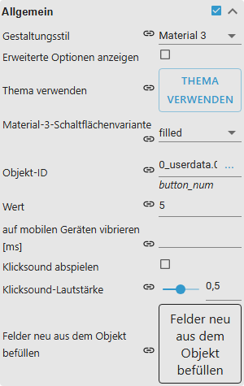
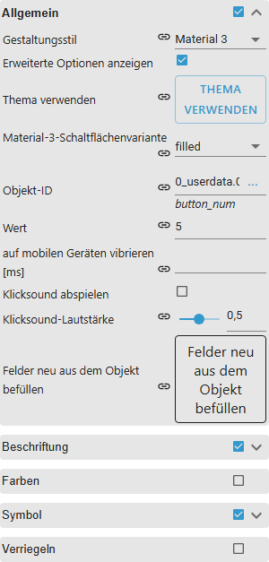

# Material Design Widgets – Anwenderhandbuch

[Projektübersicht](../../README.md) · [English](../en/README.md)

## Voraussetzungen

- ioBroker Admin 7.6.20 oder neuer
- Node.js 22 oder neuer
- installierter VIS-2-Adapter
- aktueller Chromium-basierter Browser oder Firefox als Zielumgebung

Eine vollständige Browser-/Runtime-Kompatibilitätsmatrix ist noch nicht getestet.

## Installation und Schnellstart

1. In ioBroker Admin den Adapter **Material Design Widgets**
   (`vis2-materialdesign`) installieren.
2. Den VIS-2-Editor und ein Projekt öffnen.
3. Die Widget-Gruppe **Material Design** öffnen.
4. Ein Widget in die View ziehen und auswählen.
5. Im Tab **WIDGET** den Datenpunkt und das Verhalten konfigurieren.
6. Projekt speichern und in der Runtime testen.

Für den ersten Test eignet sich **Wertanzeige**: Datenpunkt unter `oid` wählen,
Einheit und Nachkommastellen einstellen, View speichern.

## Theme verwenden

Theme-Nutzung ist optional:

1. Adapterkonfiguration öffnen.
2. Im **Theme Editor** helle und dunkle Farben, Schriften und Schriftgrößen
   konfigurieren und speichern.
3. Im VIS-2-Editor ein Widget auswählen.
4. Unter **Theme** auf **Thema verwenden** klicken und bestätigen.

Dabei werden die passenden Theme-Referenzen in das ausgewählte Widget übernommen.
Danach gesetzte Widget-Werte bleiben individuelle Überschreibungen. Das globale
JavaScript-Skript in der Adapterkonfiguration ist nur nötig, wenn Skripte direkt
auf Theme-Werte zugreifen sollen.

## Von vis-materialdesign migrieren

Wurden vis-2-Projekte mit den Widgets des Adapters vis-materialdesign von
Scrounger gebaut, wandelt der Tab **Migration** in den Einstellungen dieses
Adapters sie in diese Widgets um. Danach lässt sich der alte Adapter
deinstallieren, und die Views funktionieren weiter.

1. Diesen Adapter neben vis-materialdesign installieren.
2. Alle offenen vis-2-Editoren schließen. Ein Editor, der offen bleibt,
   überschreibt das umgewandelte Projekt beim nächsten Speichern.
3. Die Einstellungen dieses Adapters öffnen und zum Tab **Migration** wechseln.
   Er listet jedes vis-2-Projekt mit der Anzahl der enthaltenen alten Widgets.
4. Für jedes Projekt **Migrieren** drücken. Das Ergebnis erscheint unter der
   Projektliste: wie viele Widgets umgewandelt wurden und was von Hand zu
   prüfen ist.
5. **Theme übernehmen** drücken, um Farben, Schriften, Schriftgrößen und den
   Dunkelmodus-Schalter von `vis-materialdesign.0` in diesen Adapter zu
   kopieren, danach **Speichern** drücken, damit die Theme-States geschrieben
   werden. Die umgewandelten Widgets nutzen das Theme dieses Adapters; ohne
   diesen Schritt zeigen sie dessen Standardfarben, -schriften und -größen. Der
   alte Dunkelmodus-Schalter wird unverändert übernommen, als `true` oder
   `false`; der Schalter dieses Adapters kennt zusätzlich `auto`.
6. Die Views öffnen und prüfen, auch die Einträge unter **Bitte von Hand prüfen**.
7. Wenn die Views stimmen, vis-materialdesign deinstallieren. Vorher das Theme
   übernehmen und jedes Projekt der Liste migrieren: Die Deinstallation löscht
   das Theme des alten Adapters, und ein nicht migriertes Projekt verliert seine
   Widgets. Das alte Widget-Set kann als „materialdesign“ in der Editor-Palette
   von vis-2 bleiben, auch nach einem Neustart von vis-2, weil vis-2 eine eigene
   Kopie davon behält. Daraus keine Widgets mehr einfügen. Solange es bleibt,
   werden seine Styles weiter geladen und können das Aussehen einzelner Widgets
   verändern, zum Beispiel den Text von Listeneinträgen abschneiden. Das endet
   mit einer vis-2-Version, die deinstallierte Widget-Sets entfernt.

### Was automatisch umgewandelt wird

- Die Widget-Typen.
- Die Anzahl-Einstellungen. Die alten Widgets zeigten einen Eintrag mehr als die
  eingestellte Zahl; die Migration erhöht um eins, damit dieselbe Anzahl
  Einträge erscheint.
- Verweise auf `vis-materialdesign.N.`-States, in allen Widgets und in
  `vis-user.css`.
- 11 Icon-Namen, die Material Design Icons umbenannt hat.
- Die Theme-Einstellungen. Jede Farbe, Schrift und Schriftgröße, die das alte
  Widget aus dem Theme nahm, kommt jetzt aus dem Theme dieses Adapters, so wie
  es **Thema verwenden** bei einem neu eingefügten Widget einrichtet. **Theme
  übernehmen** füllt dieses Theme mit den Farben, Schriften und Größen des
  alten Adapters. Eine Farbe oder Größe, die von Hand eingestellt war, bleibt
  unverändert. Die wenigen Theme-Einstellungen ohne Gegenstück in diesem
  Adapter werden geleert, das Widget nutzt dort seine eigene Voreinstellung.

Umgewandelte Widgets behalten den klassischen Stil. Material 3 ist nur für neu
eingefügte Widgets die Voreinstellung.

### Sicherung wiederherstellen

Bevor ein Projekt zum ersten Mal geändert wird, werden seine `vis-views.json`
und `vis-user.css` als `vis-views.json.mdw-backup` und `vis-user.css.mdw-backup`
im Projektordner gesichert. Diese Sicherungen werden nie überschrieben.
**Sicherung wiederherstellen** fragt nach einer Bestätigung und setzt das
Projekt dann so zurück, wie es vor der ersten Migration war; alle späteren
Änderungen gehen verloren.

### Bitte von Hand prüfen

Die Liste **Bitte von Hand prüfen** nennt, was die Migration nicht umwandeln
kann:

- Eigene CSS-Regeln für den alten Widget-Aufbau: Selektoren, die in
  `vis-user.css` mit `.v-`, `.mdc-` oder `.materialdesign-` beginnen. Die neuen
  Widgets sind anders aufgebaut, daher müssen diese Regeln angepasst werden.
- Nutzung der alten JavaScript-Helfer `vis.binds.materialdesign` und
  `myMdwHelper` im eigenen Code.
- Icons, die es in Material Design Icons 7 nicht mehr gibt (9 Namen). Ein
  Ersatz-Icon wählen.
- **Nicht umgewandelt, unbekannter Widget-Typ**: ein Widget, dessen Typ die
  Migration nicht kennt. Es bleibt unverändert.

### Bekannte Grenzen

- Gibt es mehrere Instanzen des alten Adapters, werden alle auf diese eine
  Instanz abgebildet.
- Das Theme wird nur von `vis-materialdesign.0` übernommen.
- Eigene Skripte im javascript-Adapter, die `vis-materialdesign.0.*` nutzen,
  müssen von Hand angepasst werden. Die Schaltfläche **Skript generieren** im Tab
  **Allgemein** erzeugt das globale Theme-Skript für diesen Adapter neu.

## Gestaltungsstil

Jedes Widget wird in einem von zwei Stilen dargestellt, wählbar im Tab **WIDGET**
unter **Allgemein → Gestaltungsstil**:

- **Material 3** – Farbrollen, Formen, Typografie und State-Layer von Material 3.
  Vorbelegung für neu eingefügte Widgets.
- **Klassisch** – das gewohnte Aussehen aus der Material-Design-2-Zeit.
- **Projektstandard** – folgt dem Stil aus dem Tab **Design** der
  Adapterkonfiguration, damit ein ganzes Projekt zentral umgestellt werden kann.



Neu eingefügte Widgets erscheinen in Material 3. Bestehende Projekte bleiben
unverändert klassisch, bis du ein Widget umstellst oder den Projektstandard im
Tab **Design** änderst.

Beide Stile folgen dem Dunkelmodus von VIS 2: Text, die Flächen, die ein Widget
selbst malt (Karte, Menü, Navigationsleiste), und die Rahmen der `outlined`-Varianten
wechseln mit dem Thema. Eine Farbe, die du im Editor gesetzt hast, bleibt in beiden
Modi genau so stehen — prüfe sie also, wenn du sie für den hellen Modus ausgesucht
hast.

Material 3 ändert nur die Darstellung. Datenpunkte, Optionsnamen, Werte,
Schreibverhalten, Timer und Navigation sind in beiden Stilen identisch, und die
Rückstellung auf `Klassisch` stellt das alte Aussehen exakt wieder her. Explizit
gesetzte Farben, Schriften und Größen gewinnen weiterhin — Material 3 füllt nur
leer gelassene Werte. Damit ein Widget der Material-3-Palette folgt, diese Felder
leeren.

Der Dark-Mode folgt demselben Datenpunkt
`vis2-materialdesign.0.colors.darkTheme` wie im klassischen Stil: `auto`
übernimmt ihn vom Theme der VIS 2, `light` und `dark` erzwingen eins. Der Tab
**Design** leitet das komplette Material-3-Schema aus einer Seed-Farbe ab; ohne
Seed gilt Googles Basispalette.

### Das Schema per Skript setzen

Das fertige Schema liegt im Datenpunkt `vis2-materialdesign.0.colors.md3Scheme`
als JSON-Text, den die Widgets direkt lesen — anders als die Seed-Farbe wirkt ein
per Skript geschriebenes Schema sofort, ohne Speichern im Tab **Design**:

```json
{
  "light": { "primary": "#65558f", "on-primary": "#ffffff", "surface": "#fef7ff" },
  "dark":  { "primary": "#cfbdfe", "on-primary": "#36275d", "surface": "#141218" }
}
```

Beide Blöcke sind optional und werden unabhängig voneinander ausgewertet. Erlaubt
sind diese 18 Rollennamen:

`primary`, `on-primary`, `primary-container`, `on-primary-container`,
`secondary`, `secondary-container`, `on-secondary-container`, `tertiary`,
`error`, `surface`, `surface-container-low`, `surface-container`,
`surface-container-high`, `on-surface`, `on-surface-variant`, `outline`,
`outline-variant`, `scrim`

Als Wert ist nur eine Hex-Farbe (`#abc` oder `#aabbcc`) zulässig. Unbekannte
Rollennamen, andere Farbformate und ungültiges JSON werden übergangen, und jede
nicht gesetzte Rolle fällt auf Googles Basispalette zurück — ein leerer
Datenpunkt bedeutet also die komplette Basispalette. Die Schriftart kommt
genauso aus `vis2-materialdesign.0.fonts.md3Font`.

Jede Widget-Seite zeigt beide Stile nebeneinander, hell und dunkel.

**Erweiterte Optionen anzeigen** direkt unter dem Stil blendet die selten
benötigten Optionsgruppen des Widgets ein. Ein Widget, das solche Werte bereits
enthält, zeigt sie auch ohne den Schalter.

### Bekannte Grenzen von Material 3

- **Die Widgets lesen Instanz 0.** Theme-, Dark-Mode-, Gestaltungsstil- und
  Material-3-Datenpunkte werden unter `vis2-materialdesign.0.…` gelesen. Der Adapter
  ist ein Singleton und ioBroker legt standardmäßig Instanz 0 an, das entspricht also
  jeder normalen Installation — eine bewusst unter anderer Nummer angelegte Instanz
  wird von den Widgets aber nicht gefunden.
- **Ein per Skript geschriebener Seed berechnet das Schema nicht neu.** Die
  Seed-Farbe wird beim Speichern der Adapterkonfiguration in das vollständige
  Material-3-Schema umgerechnet, nicht bei Änderung des Datenpunkts. Den Seed also im
  Tab **Design** setzen und speichern.



## Widget nach Aufgabe wählen

- Schalten und navigieren: [Buttons](widgets/buttons.md),
  [Icon-Buttons](widgets/icon-buttons.md), [Checkbox](widgets/checkbox.md),
  [Switch](widgets/switch.md)
- Werte eingeben: [Eingabe, Select und Autocomplete](widgets/input.md),
  [Slider](widgets/slider.md), [Runder Slider](widgets/slider-round.md)
- Werte anzeigen: [Wertanzeige](widgets/value.md),
  [HTML Card](widgets/html-card.md), [Fortschritt](widgets/progress.md)
- Daten darstellen: [Liste](widgets/list.md), [Tabelle](widgets/table.md),
  [Diagramme](widgets/charts.md), [Kalender](widgets/calendar.md)
- Views strukturieren: [Top App Bar](widgets/top-app-bar.md),
  [Responsives Layout](widgets/responsive-layout.md), [Dialog](widgets/dialog.md)

[Vollständiger Widget-Katalog](widgets/README.md)

## Werte in Texten anzeigen

Die Objekt-ID eines Widgets steuert seinen Zustand — sie schreibt keinen Wert in
den Text. Werte kommen über die Bindung von VIS 2: eine Objekt-ID in geschweiften
Klammern in einem Text- oder HTML-Feld wird zur Laufzeit durch den Wert des
States ersetzt.

```
Temperatur: {0_userdata.0.temp}°C
```

Das gilt in jedem Text- und HTML-Feld dieser Widgets, also auch in der
Beschriftung, der Unterzeile und der rechten Beschriftung jeder Listenzeile, in
den Zellen der Tabelle und im HTML der [HTML Card](widgets/html-card.md). So
zeigt eine [Liste](widgets/list.md) mehrere Werte untereinander, wofür sonst
mehrere [Wertanzeigen](widgets/value.md) nötig wären.

Die Bindung wertet VIS 2 aus, nicht dieser Adapter. Das Ketten-Symbol neben dem
Feldnamen (**Feld als Bindung verwenden**) schaltet das Feld auf den
Bindungseditor von VIS 2 um, der beim Formatieren hilft (Nachkommastellen,
Umrechnung, Bedingungen).

## Fehlerbehebung

- **Widget-Gruppe fehlt:** Installation von `vis2-materialdesign` und VIS 2
  prüfen, VIS-2-Editor neu laden.
- **Theme bleibt unverändert:** Adapterkonfiguration speichern, beim Widget
  **Theme → Thema verwenden** erneut ausführen, Runtime neu laden.
- **Änderung trotz Neuinstallation unsichtbar:** Browser-Cache mit hartem
  Neuladen umgehen.
- **Widget schreibt nicht:** Schreibbarkeit des Datenpunkts, Read-only-Option
  und Verriegelung des Widgets prüfen.
- **Liste, Tabelle, Kalender oder Diagramm leer:** JSON gegen das Beispiel der
  jeweiligen Widget-Seite prüfen.
- **Zeile zeigt die Beschriftung, aber keinen Wert:** die Objekt-ID einer Zeile
  steuert nur ihren Zustand. Werte kommen über
  [Werte in Texten anzeigen](#werte-in-texten-anzeigen).
- **Eine wiederholte Gruppe (Menüpunkt, Datensatz, Spalte, View) wächst nicht:**
  den **+**-Knopf in der Kopfzeile der letzten dieser Gruppen benutzen. Eine
  getippte Zahl im zugehörigen Anzahl-Feld baut die Gruppen nicht sofort neu auf —
  VIS 2 zeichnet sie nur über den Knopf oder nach einem Wechsel der Auswahl neu.
  Die letzte Gruppe zeigt nur ihre Kopfzeile mit den Knöpfen: sie ist die
  Hinzufügen-Leiste, kein Eintrag. Die Anzahl bleibt damit immer die Anzahl der
  Einträge.

## Browserhinweis

Vibration ist nicht in jedem Browser oder Gerät verfügbar. Maßgeblich ist die
[Browser-Kompatibilität der Vibration API](https://developer.mozilla.org/en-US/docs/Web/API/Navigator/vibrate#browser_compatibility).

Fehler bitte mit Adapterversion, Browser, betroffenem Widget und einem Screenshot
im [Issue-Tracker](https://github.com/typhosj/ioBroker.vis2-materialdesign/issues) melden.
