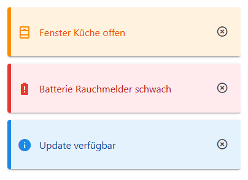
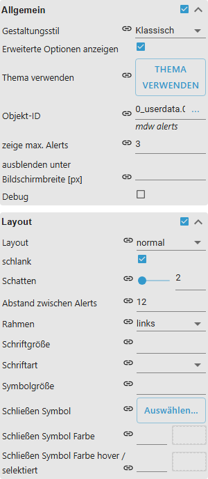
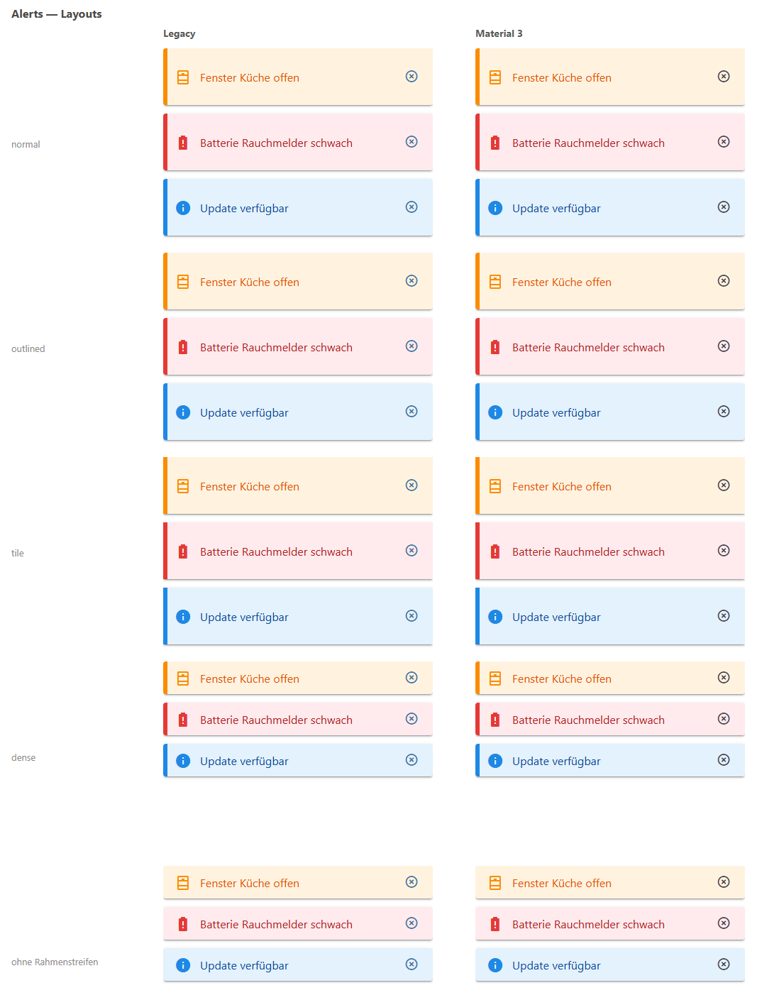
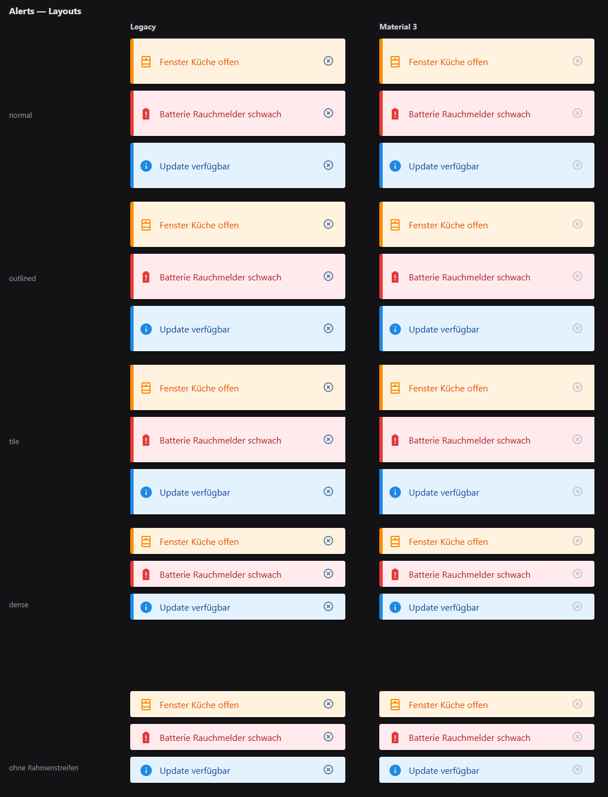

# Warnmeldungen

[Anwenderhandbuch](../README.md) › [Widget-Katalog](README.md) · [English](../../en/widgets/alerts.md)

Zeigt eine JSON-Warteschlange als Material-Design-Meldungen. Geschlossene
Meldungen werden aus dem State entfernt. Template-ID:
`tplVis2-materialdesign-Alerts`.



## Editor-Einstellungen

Der Screenshot zeigt die Gruppen **Allgemein** und **Layout** aufgeklappt. Nicht
aufgeführte Einstellungen sind selbsterklärend.



**Allgemein**

- **Objekt-ID** – State mit dem JSON-Meldungs-Array.
- **max. Meldungen** – wie viele Meldungen gleichzeitig gezeigt werden.
- **min. Bildschirmauflösung** – blendet das Widget unterhalb dieser Breite aus.

**Layout**

- **Layout** – normal, umrandet oder Kachel.
- **dicht / Höhe / Abstand unten** – Kompaktheit, Schattentiefe und Abstand zwischen Meldungen.
- **Rand-Layout** – Rahmenstil jeder Meldung.
- **Schließen-Icon / Farbe** – das Schließen-Icon und seine Farbe; Schließen entfernt die Meldung aus dem State.

```json
[
    {
        "text": "Fenster ist offen",
        "icon": "alert-outline",
        "backgroundColor": "#fff8e1",
        "borderColor": "#ffc107",
        "iconColor": "#ffc107",
        "fontColor": "#333333"
    }
]
```

Der State muss ein JSON-Array enthalten. Ungültiges JSON erscheint als Fehler.

## Gestaltungsstil

Die Stile **Klassisch** (links) und **Material 3** (rechts) nebeneinander, siehe
[Gestaltungsstil](../README.md#gestaltungsstil): die Layouts normal, outlined,
tile und dense sowie eine Meldung ohne Rahmenstreifen.



Dieselben Widgets bei eingeschaltetem Dark-Theme:


