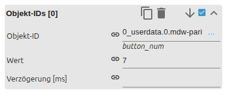

# Buttons

[Anwenderhandbuch](../README.md) › [Widget-Katalog](README.md) · [English](../../en/widgets/buttons.md)

Sechs native VIS-2-Buttonvarianten für Navigation, Links, Zustandswerte,
mehrere Zustände, numerische Addition und Ein/Aus-Umschaltung.

Template-IDs: `tplVis2-materialdesign-Button-Navigation`, `-Link`, `-State`,
`-State-Multi`, `-Adition` und `-Toggle`.

## Editor-Einstellungen

Variante im Widget-Set **Material Design** wählen, markieren und den Reiter
**WIDGET** öffnen. Die Screenshots nutzen die Varianten *State* und
*Multi State*. Nicht aufgeführte Einstellungen sind selbsterklärend.

**Allgemein** – die Aktionsfelder hängen von der Variante ab:

- **Navigation** – zu öffnende VIS-2-Zielansicht.
- **Link** – URL und *in neuem Fenster öffnen*.
- **State** – Objekt-ID und der beim Klick geschriebene Wert.
- **Addition** – Schrittweite (`+`/`-`) mit optionaler Min-/Max-Begrenzung.
- **Toggle** – *Umschalttyp* (`boolean` oder eigene Aus-/Ein-Werte) und *Taster* (bei Drücken und Loslassen schreiben).

**Beschriftung**

- **Buttontext / Beschriftung true** – Text; im Ein-Zustand kann ein zweiter Text erscheinen.
- **Ausrichtung** – Anordnung von Icon/Text im Button.

Die Variante **Multi State** ersetzt den einzelnen Wert durch indizierte
Objekt-/Wert-Zeilen mit jeweils eigener Verzögerung:

Die Gruppe **Bild / Icon** nimmt einen Material-Design-Iconnamen oder eine
Bildquelle (mit eigener Ein-Zustand-Farbe), **Farben** überschreibt das Thema,
**Feedback** ergänzt Haptik und Klicksound, und **Verriegeln** verlangt einen
Entsperr-Klick vor der Aktion.
