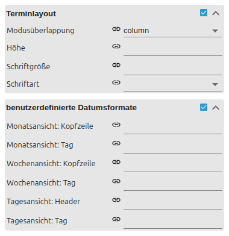

# Kalender

[Anwenderhandbuch](../README.md) › [Widget-Katalog](README.md) · [English](../../en/widgets/calendar.md)

Nativer VIS-2-Monats-, Wochen- und Tageskalender aus einem JSON-Termin-State.
Template-ID: `tplVis2-materialdesign-Calendar`.


Wochen-/Tagesansicht mit Zeitachse:


## Editor-Einstellungen

Die Screenshots zeigen die Allgemein-/Layout-Gruppen sowie die Termin- und
Datumsformat-Gruppen. Nicht aufgeführte Einstellungen sind selbsterklärend.


**Allgemein**

- **Objekt-ID** – State mit dem JSON-Termin-Array.
- **Kalenderansicht** – Monat, Woche oder Tag.

**Layout**

- **Wochentage / Kurze Wochentage** – volle oder abgekürzte Wochentagsnamen.
- **Rahmen- / Tageshintergrundfarben** – Raster- und Tageszellenfarben.

Termindarstellung und Datumsformate haben eigene Gruppen:



- **Termin-Überlappungsmodus** – wie gleichzeitige Termine angeordnet werden (gestapelt oder nebeneinander).
- **Terminhöhe / Schriften** – Größe und Typografie der Termine.
- **benutzerdefinierte Datumsformate** – je Ansicht Kopf- und Tagesformat mit Datums-Token (z. B. `dddd`, `D. MMMM`).

Die Gruppen für Kopfzeile, Kalenderwochen, Bedienung und Zeitachse gestalten die
übrige Kalenderoberfläche.

```json
[
    {
        "start": "2026-07-18T10:00:00",
        "end": "2026-07-18T11:00:00",
        "name": "Termin",
        "color": "#44739e",
        "colorText": "#ffffff"
    }
]
```

Der State muss ein JSON-Array enthalten.
