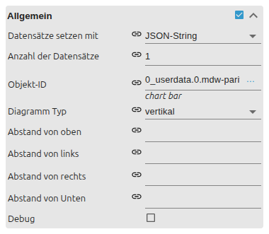
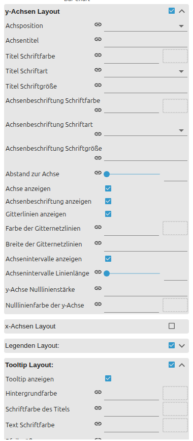

# Balkendiagramm

[Anwenderhandbuch](../README.md) › [Widget-Katalog](README.md) › [Diagramme](charts.md) · [English](../../en/widgets/chart-bar.md)

Vergleicht aktuelle Werte als vertikale oder horizontale Balken.
Template-ID: `tplVis2-materialdesign-Chart-Bar`.

## Datenquelle

- **Eingabe über Editor:** jeder Datensatz verweist auf einen eigenen State. Anzahl der Datensätze legt die indizierten Gruppen an.
- **JSON-String/Objekt:** Objekt-ID verweist auf einen State mit einem JSON-Array. Datensätze und ihre Darstellung kommen gemeinsam aus diesem State.
- **Diagrammtyp:** horizontal vertauscht Kategorie- und Wertachse; Min/Max gelten weiterhin für die Wertachse.

Bei Editor-Eingabe enthält jede Datensatzgruppe Objekt-ID, Achsenbeschriftung,
optionale Farbe, abweichenden Werttext und Tooltip-Texte. Ohne feste
Achsenwerte skaliert das Widget automatisch und bezieht Null mit ein.

## Editor-Einstellungen

Die Editor-Sprache folgt der ioBroker-Systemsprache, daher sind die Screenshots
deutsch. Nicht aufgeführte Einstellungen sind selbsterklärend.



- **Allgemein** – Datenquelle (Editor-Datensätze oder ein JSON-State), Anzahl der Datensätze, Objekt-ID und **Diagrammtyp** (vertikal oder horizontal). Je Editor-Datensatz ergänzt eine indizierte Gruppe dessen Objekt-ID, Achsenbeschriftung, Farbe und Tooltip-Texte.
- **Balkendiagramm Layout** – Balkenstärke und -abstand.



- **y-Achse** – Achsentitel, Position (links / rechts), Gitterlinien und Sichtbarkeit von Achse/Beschriftung. Das **Minimum / Maximum** der Wertachse liegt in der Gruppe Diagramm Layout (leer = automatische Skalierung).
- **Tooltip** – Tooltip aktivieren und Farben setzen; ein `tooltipText` je Datensatz ersetzt den erzeugten Text.

Die gemeinsamen Gruppen **Diagramm Layout**, **Legende** und Farbschema aus
[Diagramme](charts.md) gelten hier ebenfalls.

## JSON-Format

Der State muss ein Array enthalten. Nicht gesetzte Darstellungswerte fallen auf
Farbschema und globale Widget-Einstellungen zurück.

| Eigenschaft | Bedeutung |
| --- | --- |
| `label` | Beschriftung auf der Kategorieachse |
| `value` | numerischer Balkenwert |
| `dataColor` | Farbe dieses Balkens |
| `valueText` | eigener Werttext im automatisch erzeugten Tooltip |
| `valueAppendix` | Zusatz hinter dem Werttext im Tooltip |
| `tooltipTitle` | eigener Tooltip-Titel |
| `tooltipText` | eigener Tooltip-Inhalt |

```json
[
    { "label": "PV", "value": 4.8, "dataColor": "#f9a825", "valueAppendix": " kW" },
    { "label": "Netz", "value": 1.2, "dataColor": "#44739e", "tooltipTitle": "Netzbezug" }
]
```

## Relevante Layoutoptionen

- Minimum und Maximum begrenzen die Wertachse. Leere Felder behalten automatische Skalierung.
- Tooltip-Texte pro Datensatz ersetzen die automatisch erzeugte Beschriftung.
- Bei horizontaler Darstellung werden X- und Y-Achse funktional vertauscht: X enthält Werte, Y die Kategorien.
