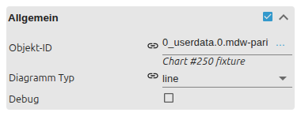

# JSON-Diagramm

[Anwenderhandbuch](../README.md) › [Widget-Katalog](README.md) › [Diagramme](charts.md) · [English](../../en/widgets/chart-json.md)

Erzeugt ein Balken-, Linien- oder gemischtes Diagramm aus einem JSON-State.
Template-ID: `tplVis2-materialdesign-Chart-JSON`.

## Datenformat

Der unter Objekt-ID gewählte State muss ein Objekt mit `axisLabels` und
`graphs` enthalten. `axisLabels` benennt gemeinsame Positionen auf der
X-Achse. Jeder Eintrag in `graphs` erzeugt eine Datenreihe.

```json
{
    "axisLabels": ["Mo", "Di", "Mi", "Do"],
    "graphs": [
        {
            "type": "bar",
            "legendText": "Verbrauch",
            "color": "#44739e",
            "data": [4.2, 5.1, 4.8, 6.0],
            "barIsStacked": true,
            "barStackId": 1
        },
        {
            "type": "line",
            "legendText": "PV",
            "color": "#f9a825",
            "data": [2.1, 4.7, null, 5.4],
            "line_spanGaps": false,
            "line_Thickness": 3
        }
    ]
}
```

Fehlerhaftes JSON zeigt `Error in JSON string`. Fehlende, leere oder nicht
numerische Datenwerte werden als Lücke behandelt.

## Editor-Einstellungen

Das Diagramm wird größtenteils vom JSON-State gesteuert; der Editor setzt nur
Quelle und globale Vorgaben. Die Editor-Sprache folgt der ioBroker-Systemsprache,
daher ist der Screenshot deutsch.



- **Allgemein** – die Objekt-ID des oben beschriebenen JSON-States und der globale **Diagrammtyp** (`bar` oder `line`) für Datenreihen ohne eigenes `type`.

Kartenlayout sowie die gemeinsamen Gruppen **Legende**, **Tooltip** und Achsen
aus [Diagramme](charts.md) gelten; das Aussehen je Datenreihe stammt aus den
JSON-Eigenschaften unten.

## Eigenschaften einer Datenreihe

| Eigenschaft | Bedeutung |
| --- | --- |
| `data` | Werte passend zur Reihenfolge von `axisLabels`; Zahl oder `{ "y": Zahl }` |
| `type` | `bar` oder `line`; überschreibt den globalen Diagrammtyp |
| `legendText` | Bezeichnung in der Legende |
| `color` | Linien- oder Balkenfarbe |
| `line_Thickness` | Linienbreite; dient auch als Rückfallwert für Balkenrahmen |
| `line_steppedLine` | verbindet Linienwerte stufenförmig |
| `line_spanGaps` | verbindet Punkte über `null`-Lücken hinweg |
| `line_UseFillColor` | füllt die Fläche unter der Linie |
| `line_FillColor` | eigene Füllfarbe; sonst transparente Variante von `color` |
| `barBorderWidth` | Breite des Balkenrahmens |
| `barIsStacked` | aktiviert Stapelung für die Reihe und ihre Y-Achse |
| `barStackId` | Reihen mit derselben ID bilden einen Stapel |
| `yAxis_id` | Reihen mit derselben ID verwenden dieselbe Y-Achse; ohne Angabe nutzen alle ID `0` |
| `yAxis_position` | platziert diese Y-Achse links oder rechts |
| `yAxis_min`, `yAxis_max` | feste Grenzen dieser Y-Achse; leere Werte skalieren automatisch |

## Gemischte Diagramme und Achsen

Der globale Diagrammtyp gilt nur für Reihen ohne eigenes `type`. Dadurch lassen
sich Balken und Linien mischen. Gestapelte Balken brauchen dieselbe
`barStackId`; nicht gestapelte Reihen erhalten keinen Stack.

Für verschiedene Einheiten eine eigene `yAxis_id` vergeben, etwa `0` für kW
links und `1` für Prozent rechts. Reihen derselben Einheit sollten dieselbe ID
nutzen, damit keine doppelten Achsen entstehen.

Das Widget verwendet `axisLabels` als Kategorien. Für echte, direkt aus einer
History-Instanz geladene Zeitachsen ist das
[Linienverlaufsdiagramm](chart-line-history.md) vorgesehen.
