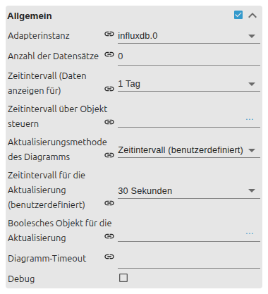
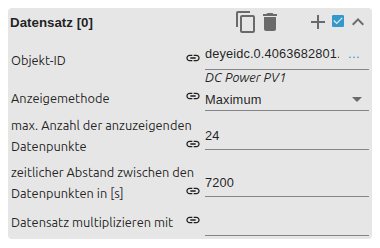

# Linienverlaufsdiagramm

[Anwenderhandbuch](../README.md) › [Widget-Katalog](README.md) › [Diagramme](charts.md) · [English](../../en/widgets/chart-line-history.md)

Lädt mehrere Zeitreihen aus einer ioBroker-History-Instanz.
Template-ID: `tplVis2-materialdesign-Chart-Line-History`.

Benötigt eine konfigurierte Instanz von History, SQL oder InfluxDB sowie für
jeden verwendeten State aktivierte Aufzeichnung.

## Zeitraum und Aktualisierung

- **History-Adapterinstanz:** Quelle aller Zeitreihen.
- **Anzuzeigender Zeitraum:** rückwirkendes Fenster bis zum aktuellen Zeitpunkt.
- **Zeitraum über Objekt:** überschreibt das feste Fenster zur Laufzeit.
- **Aktualisierung:** in Echtzeit, in festem Intervall oder über ein Triggerobjekt.
- **Chart-Timeout:** maximale Wartezeit der History-Abfrage in Sekunden.

Diese Optionen liegen in der Gruppe **Allgemein**. Die Editor-Sprache folgt der
ioBroker-Systemsprache, daher sind die Screenshots deutsch.

Der State unter „Zeitraum über Objekt“ unterstützt zwei Arten von Werten:

- String: eine angebotene Intervallbezeichnung wie `30 seconds`, `10 minutes`, `1 day` oder `1 year`.
- Zahl: Startzeitpunkt als Unix-Zeitstempel in Millisekunden. Ende bleibt aktueller Zeitpunkt.

Eine Änderung des manuellen Trigger-States startet eine neue Abfrage; sein
eigener Wert ist unwichtig. Bei Intervallaktualisierung gilt mindestens eine
Sekunde, auch wenn ein kleinerer Wert konfiguriert wird.

## Datensätze und History-Abfrage

Jede indizierte Gruppe beschreibt einen aufgezeichneten State und seine
Abfrage. Darstellungsoptionen derselben Indexnummer gehören zu dieser
Zeitreihe. Ohne eigenen Legendentext wird die Objekt-ID angezeigt.

| Einstellung | Wirkung |
| --- | --- |
| Objekt-ID | State mit aktivierter History-Aufzeichnung |
| Aggregation | `minmax`, `min`, `max`, `average` oder `total` werden an die History-Instanz übergeben |
| Maximale Datenpunkte | begrenzt die zurückgelieferte Punktzahl; Standard 50 bei `minmax`, sonst 100 |
| Minimaler Zeitabstand | Abfrageschritt in Sekunden; leer oder `0` lässt die History-Instanz wählen |
| Multiplikator | rechnet jeden gültigen Wert vor der Darstellung um, etwa `0.001` von W in kW |

Nicht numerische und `null`-Werte werden ausgelassen. Bei einer fehlenden
History-Instanz oder nicht erreichbarer History-API bleibt das Diagramm leer.
Bei Timeouts zuerst Aufzeichnungsstatus und Zeitraum prüfen, danach den
Chart-Timeout erhöhen.

## Verlauf und Achsen

- `steppedLine` zeichnet Zustandswechsel als Stufen statt als direkte Verbindung.
- Füllfarbe schattiert den Bereich unter einer Linie; ohne eigene Füllfarbe wird eine transparente Linienfarbe verwendet.
- Neu angelegte Datensätze teilen standardmäßig eine Y-Achse. Deren Position, Titel und Grenzen stammen aus der ersten Datensatzgruppe. Leere Min-/Max-Felder behalten automatische Skalierung.
- X-Achsen-Zeitformat verwendet Moment-Format-Token, beispielsweise `HH:mm` für eine 24-Stunden-Anzeige. Dasselbe Format wird auf Sekunden, Minuten, Stunden und Tage angewendet.
- Tooltip-Modus `index` vergleicht Reihen am gleichen X-Wert; `nearest` zeigt den nächstgelegenen Punkt.
