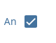
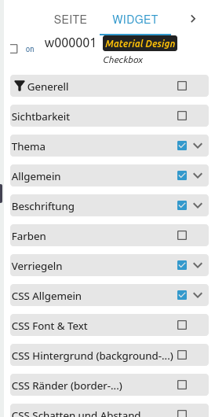

# Checkbox

[Zurück zur README](../../../README.md#widget-documentation)

Eine Material-Design-Checkbox, die einen Datenpunkt liest und schreibt – boolesch
oder mit eigenen Ein-/Aus-Werten, mit optionaler Beschriftung, Theming, Farben
und einer Sperr-Überlagerung.

Widget-Template-ID: `tplVis2-materialdesign-Checkbox`.

## Editor-Einstellungen

Widget im VIS-2-Editor auswählen und den Reiter **WIDGET** öffnen. Nicht
aufgeführte Einstellungen sind selbsterklärend.

<table>
<tr><td rowspan="3"></td>
<td><b>Art der Umschaltung</b></td><td><code>boolean</code> schreibt true/false; <code>value</code> schreibt den eigenen <i>Wert für aus</i> / <i>Wert für ein</i>.</td></tr>
<tr><td><b>Zustand, wenn Wert ungleich 'Ein'</b></td><td>Welchen Zustand die Checkbox zeigt, wenn der Wert weder dem Aus- noch dem Ein-Wert entspricht.</td></tr>
<tr><td><b>labelPosition</b></td><td>Beschriftung <code>links</code>, <code>rechts</code> oder <code>aus</code>; <i>Label-Klick aktivieren</i> lässt auch das Label umschalten.</td></tr>
</table>

* **Farben** und **Verriegeln** sind optionale Gruppen – über das Kontrollkästchen
  neben dem Gruppentitel aktivieren. Farben überschreibt das Theme (Box, Rahmen,
  Hover, Label); Verriegeln fügt eine Sperr-Überlagerung hinzu, die vor dem Ändern
  entsperrt werden muss und nach einer Verzögerung wieder sperrt.
* **Thema** übernimmt Farben und Schriften aus dem zentralen Material-Design-Theme;
  dazu die Gruppe Farben deaktiviert lassen.
