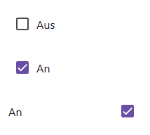
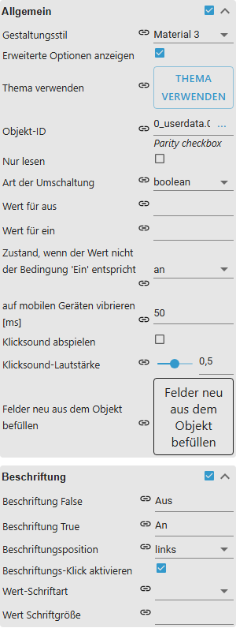
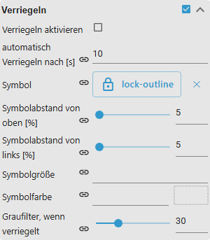
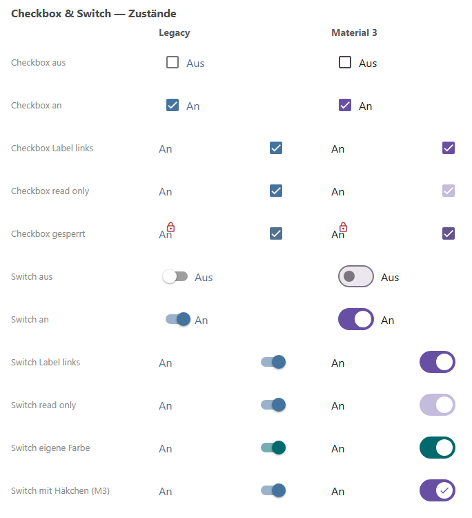
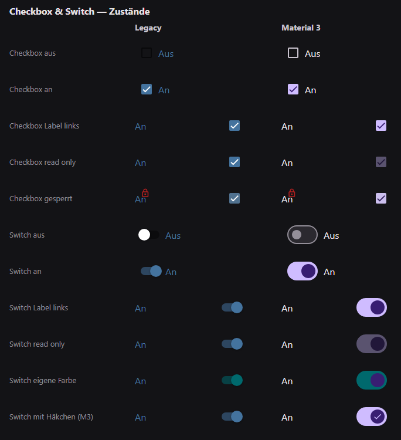

# Checkbox

[Anwenderhandbuch](../README.md) › [Widget-Katalog](README.md) · [English](../../en/widgets/checkbox.md)

Eine native Material-Design-Checkbox für VIS 2, die boolesche oder eigene
Aus-/Ein-Werte liest und schreibt. Template-ID:
`tplVis2-materialdesign-CheckBox`.

## Editor-Einstellungen

Der Screenshot zeigt die beiden relevanten Gruppen (**Allgemein** und
**Beschriftung**) aufgeklappt. Nicht aufgeführte Einstellungen sind
selbsterklärend.

**Allgemein**

- **Art der Umschaltung** – `boolean` liest und schreibt `true`/`false`; **Wert**
  liest und schreibt stattdessen **Wert für aus** / **Wert für ein**. Nur bei
  `boolean` gilt streng `true` als Ein; jeder andere Wert ist Aus.
- **Zustand, wenn der Wert nicht der Bedingung 'Ein' entspricht** – greift nur
  bei der Umschaltung **Wert**: `an` zeigt jeden Wert als Ein, der nicht dem
  Aus-Wert entspricht, `aus` nur den genauen Ein-Wert.
- **auf mobilen Geräten vibrieren [ms]** – Dauer der haptischen Rückmeldung beim
  Drücken in Millisekunden (nur mobil), Vorgabe 50; `0` schaltet die Vibration ab.
- **Klicksound abspielen** / **Klicksound-Lautstärke** – Klickton beim Schalten
  und seine Lautstärke von 0 bis 1 (Vorgabe 0,5).
- **Nur lesen** – zeigt den Zustand an, schreibt aber nie.

**Beschriftung**

- **Beschriftung False / True** – Text neben der Box im Aus- / Ein-Zustand.
- **Beschriftungsposition** – links, rechts oder aus.
- **Beschriftungs-Klick aktivieren** – ein Klick auf die Beschriftung schaltet
  den Wert um, nicht nur die Box. Vorgabe: an.
- **Wert-Schriftart / Wert Schriftgröße** – Schrift der Beschriftung.

**Farben** steuert **Kontrollkästchen Farbe**, **Randfarbe**, **Farbe selektiert
/ hover** sowie **Beschriftungsfarbe** und **Beschriftungsfarbe für true**.

**Verriegeln** legt eine Sperre über das Widget: **Verriegeln aktivieren**
schaltet sie ein, ein Klick auf das Symbol entriegelt, und **automatisch
Verriegeln nach [s]** (Vorgabe 10) verriegelt wieder. **Graufilter, wenn
verriegelt** (Vorgabe 30 %) blasst das gesperrte Widget aus; für das **Symbol**
lässt sich ein Icon oder ein Bild auswählen, seine Position setzen
**Symbolabstand von oben / links [%]**.

## Gestaltungsstil

Die Stile **Klassisch** (links) und **Material 3** (rechts) nebeneinander, siehe
[Gestaltungsstil](../README.md#gestaltungsstil): Checkbox und Switch: aus, an,
Label links, read only, gesperrt, eigene Farbe und das Material-3-Häkchen im
Switch-Griff.

Dieselben Widgets bei eingeschaltetem Dark-Theme:

