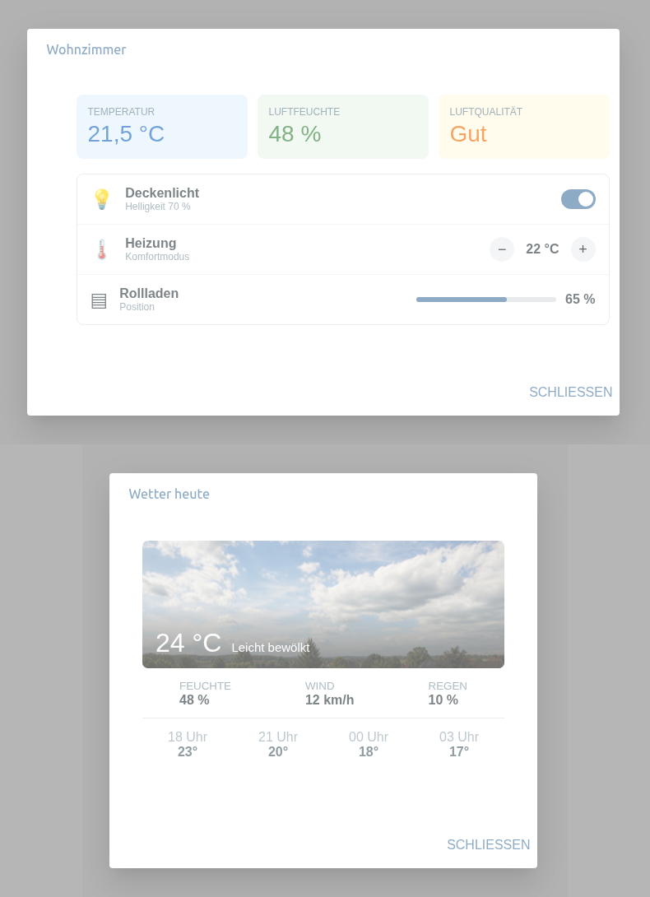
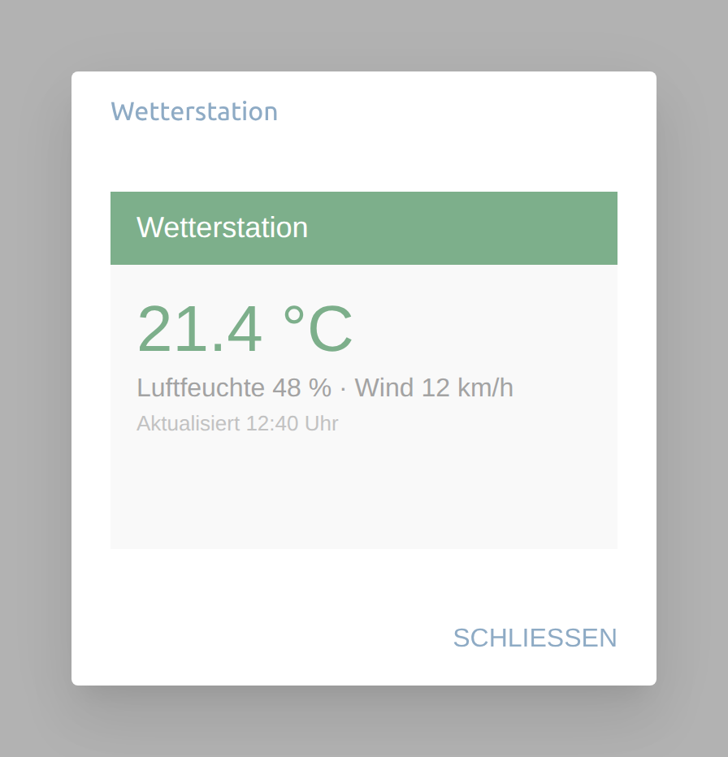
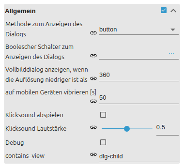
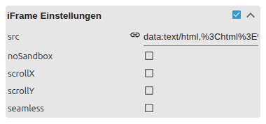

# Dialog

[Anwenderhandbuch](../README.md) › [Widget-Katalog](README.md) · [English](../../en/widgets/dialog.md)

Zwei per State geöffnete VIS-2-Dialoge: einer bettet eine VIS-2-Ansicht ein, der
andere eine iFrame-URL.

Template-IDs: `tplVis2-materialdesign-Vuetify-Dialog-View` und
`tplVis2-materialdesign-Vuetify-Dialog-iFrame`.

Links: ein Dialog mit eingebetteter VIS-2-View (ein Raum-Steuerpanel). Rechts: ein Dialog mit eingebetteter iFrame-Seite.

## Editor-Einstellungen

Die Screenshots zeigen die Gruppe **Allgemein** des View-Dialogs und die
iFrame-Gruppe. Nicht aufgeführte Einstellungen sind selbsterklärend.

**Allgemein**

- **Öffnungsmethode** – lokaler Button oder Datenpunkt. Beim Datenpunkt öffnet boolesch `true` den Dialog, Schließen schreibt `false`.
- **Öffnen-Datenpunkt** – der State, der die Datenpunkt-Methode steuert.
- **Vollbild unterhalb Auflösung** – zeigt den Dialog unterhalb dieser Bildschirmbreite im Vollbild.
- **eingebettete View** (`contains_view`) – die im Dialog gezeigte VIS-2-Ansicht (View-Variante).

Die Variante **iFrame** ersetzt die eingebettete View durch eine Webseite:

- **URL** – im iFrame angezeigte Seite.
- **keine Sandbox** – deaktiviert die iFrame-Sandbox; nur für vertrauenswürdige Inhalte.
- **Scroll X / Y / seamless** – Scroll- und nahtlose Einbettungsoptionen.

Text/Stil des Auslöse-Buttons, Dialoggröße, Kopfzeile, Fußzeile und
Aktionsbuttons haben eigene Layoutgruppen.

Für dauerhaft eingebettete Inhalte ohne Dialog siehe
[Advanced View in Widget](html-widgets.md).
