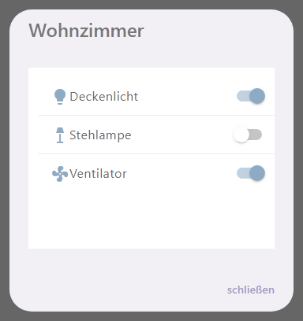
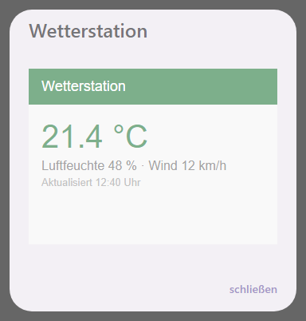
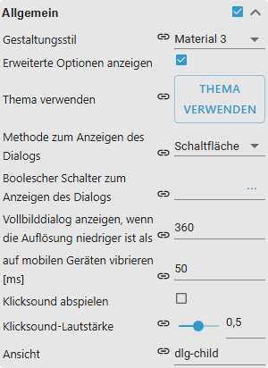
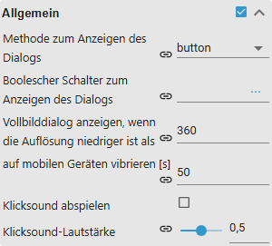

# Dialog

[Anwenderhandbuch](../README.md) › [Widget-Katalog](README.md) · [English](../../en/widgets/dialog.md)

Zwei per State geöffnete VIS-2-Dialoge: einer bettet eine VIS-2-Ansicht ein, der
andere eine iFrame-URL.

Template-IDs: `tplVis2-materialdesign-Vuetify-Dialog-View` und
`tplVis2-materialdesign-Vuetify-Dialog-iFrame`.

Links: ein Dialog mit eingebetteter VIS-2-View (ein Raum-Steuerpanel). Rechts: ein Dialog mit eingebetteter iFrame-Seite.

## Editor-Einstellungen

Die Screenshots zeigen die Gruppe **Allgemein** des View-Dialogs und die
iFrame-Gruppe. Nicht aufgeführte Einstellungen sind selbsterklärend.

**Allgemein**

- **Methode zum Anzeigen des Dialogs** – `Schaltfläche` (der eigene Button des
  Widgets öffnet ihn) oder `Datenpunkt`.
- **Boolescher Schalter zum Anzeigen des Dialogs** – der State für die Methode
  `Datenpunkt`: `true` öffnet den Dialog, das Schließen schreibt `false` zurück.
- **Vollbilddialog anzeigen, wenn die Auflösung niedriger ist als** – unterhalb
  dieser Fensterbreite in Pixeln füllt der Dialog den Bildschirm.
- **Ansicht** – die im Dialog gezeigte VIS-2-Ansicht (nur View-Variante).

Die Variante **iFrame** ersetzt die eingebettete Ansicht durch eine Webseite:

**iFrame Einstellungen**

- **Quelle** – die im iFrame angezeigte URL. Es zählen nur `http:`- und
  `https:`-Adressen (sowie `mailto:`/`tel:`); ein `data:`- oder `javascript:`-Wert
  wird verworfen und der Rahmen bleibt leer.
- **Sandbox deaktivieren** – hebt die iFrame-Sandbox auf; nur für
  vertrauenswürdige Inhalte, die sonst nicht laufen.
- **horizontal scrollen / vertikal scrollen / nahtlos** – Scrollbalken und
  nahtlose Einbettung.

**Layout Dialog**

- **maximale Breite / Höhe / Abstand zum Rand** – Größe des Dialogs; die Breite
  darf auch eine CSS-Angabe wie `96vw` sein.
- **Schließen beim Klicken außerhalb** – abgeschaltet bleibt nur der
  Schließen-Button.
- **Überlagerungsfarbe des Hintergrunds / Transparenz** – die abgedunkelte Fläche
  hinter dem Dialog.
- **Höhe der Kopfzeile / Höhe der Fußzeile / Trennlinie anzeigen / z-Index** –
  Aufbau des Dialograhmens.

**Button Layout** gestaltet den auslösenden Button (**Buttontext**,
**Schaltflächenstil**, Symbol, Farben), **Layout Kopfzeile** den **Titel** —
ohne eigenen Titel steht der Name der Ansicht dort — und **Layout der
Schaltflächen in der Dialogfußzeile** den Schließen-Button (**Text des
Schließen-Buttons**, Position, Größe, volle Breite).

Für dauerhaft eingebettete Inhalte ohne Dialog siehe
[Advanced View in Widget](html-widgets.md).
