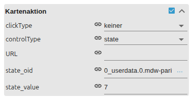

# HTML Card

[Anwenderhandbuch](../README.md) › [Widget-Katalog](README.md) · [English](../../en/widgets/html-card.md)

Native VIS-2-Material-Design-Karte mit Titel, Untertitel, Text, Bild und optionaler
Link- oder State-Aktion. Template-ID: `tplVis2-materialdesign-Card`.

## Editor-Einstellungen

Die Screenshots zeigen die Layout-/Bild-Gruppen und die Aktionsgruppe. Nicht
aufgeführte Einstellungen sind selbsterklärend.

**Allgemein**

- **Kartenlayout** – Basic, Basic Header, Header Overlay oder Horizontal.
- **Kartenstil** – Standard oder umrandet.

**Bild**

- **Bild** – Bildquelle (Pfad, URL oder Data-URL).
- **Refresh-Objekt / Verzögerung** – lädt das Bild bei State-Änderung nach, mit Verzögerung.
- **Refresh bei Aufwachen / Ansichtswechsel** – weitere Auslöser für das Neuladen.

Die Gruppe **Kartenaktion** macht die Karte klickbar:

- **Klicktyp** – welcher Bereich reagiert (ganze Karte, Bild oder Text).
- **Steuerungstyp** – URL öffnen oder State schreiben.
- **href / State-Objekt + Wert** – das vom gewählten Steuerungstyp genutzte Ziel.

Inhaltsfelder (Titel, Untertitel, Text) unterstützen VIS-2-HTML/Bindings. Nur
vertrauenswürdiges HTML nutzen.
