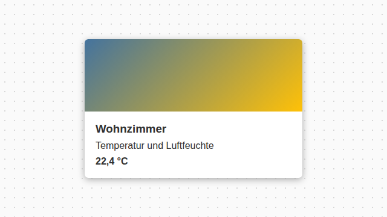
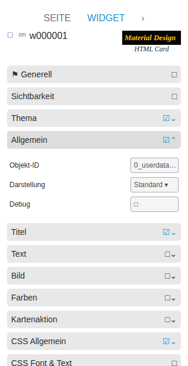

# HTML Card

[Zurück zur README](../../../README.md#widget-documentation)

Native VIS-2-Material-Design-Karte mit Titel, Untertitel, Text, Bild und optionaler
Link- oder State-Aktion. Template-ID: `tplVis2-materialdesign-Card`.

## Editor-Einstellungen

<table>
<tr><td></td>
<td><ul><li><b>Kartenlayout:</b> Basic, Basic Header, Header Overlay oder Horizontal.</li><li><b>Kartenstil:</b> Standard oder umrandet.</li><li><b>Bild:</b> Quelle sowie optionales Refresh-Objekt und Verzögerung.</li><li><b>Kartenaktion:</b> URL oder State-Schreibvorgang über Karte, Bild oder Text.</li></ul></td></tr>
</table>

Inhaltsfelder unterstützen VIS-2-HTML/Bindings. Nur vertrauenswürdiges HTML nutzen.
