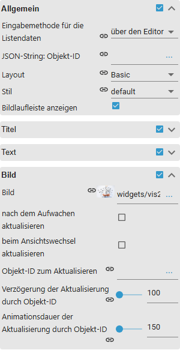
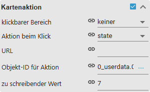
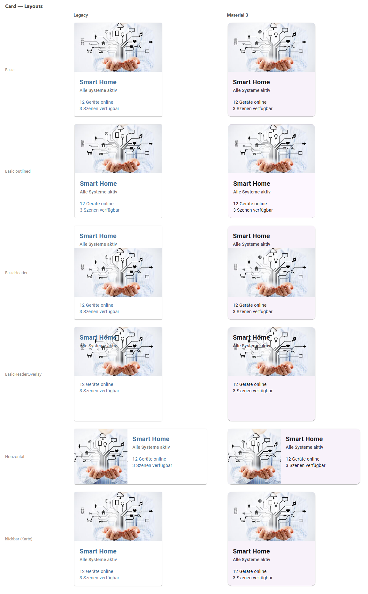
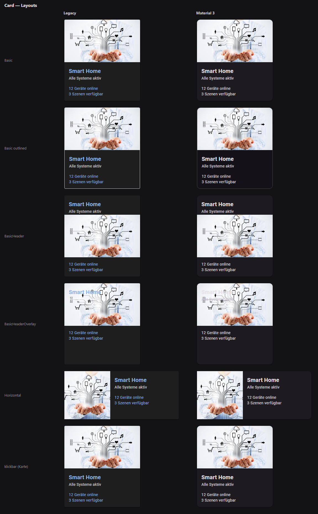

# HTML Card

[Anwenderhandbuch](../README.md) › [Widget-Katalog](README.md) · [English](../../en/widgets/html-card.md)

Native VIS-2-Material-Design-Karte mit Titel, Untertitel, Text, Bild und optionaler
Link- oder State-Aktion. Template-ID: `tplVis2-materialdesign-Card`.

## Editor-Einstellungen

Die Screenshots zeigen die Layout-/Bild-Gruppen und die Aktionsgruppe. Nicht
aufgeführte Einstellungen sind selbsterklärend.

**Allgemein**

- **Eingabemethode für die Listendaten** – `über den Editor` (Titel, Untertitel,
  Text und Bild stehen in den Feldern) oder `JSON-String` (ein State liefert sie).
- **JSON-String: Objekt-ID** – der State für die Methode `JSON-String`. Sein Wert
  ist ein Objekt mit `title`, `subTitle`, `body` und `image`; ist er kein gültiges
  JSON, steht statt des Titels eine rote Fehlermeldung in der Karte.
- **Layout** – `Basic` (Bild oben, Titel darunter), `BasicHeader` (Titel über dem
  Bild), `BasicHeaderOverlay` (Titel im Bild) oder `Horizontal` (Bild links).
- **Stil** – `Standard` oder `outlined` (Rahmen statt Schatten).
- **Bildlaufleiste anzeigen** – lässt den Textbereich scrollen, wenn er länger
  ist als die Karte.

**Titel / Text**

- **Überschrift anzeigen / Untertitel anzeigen / Text anzeigen** – blenden die
  drei Abschnitte einzeln aus.
- **Titel / Untertitel / HTML** – die Inhalte. Sie dürfen HTML und Bindungen
  enthalten, siehe [Werte in Texten anzeigen](../README.md#werte-in-texten-anzeigen).
  Nur vertrauenswürdiges HTML nutzen.
- **Schriftgröße des Titels / Textgröße** – die Typografiestufen von Material
  Design statt fester Pixelwerte.
- **Höhe des Untertitels / Texthöhe** – feste Höhe des jeweiligen Abschnitts.

**Bild**

- **Bild** – Bildquelle (Pfad, URL oder Data-URL).
- **Objekt-ID zum Aktualisieren** – ändert sich dieser State, wird das Bild neu
  geladen. Das funktioniert nur bei einer URL oder einem absoluten Pfad, nicht
  bei einer Data-URL.
- **Verzögerung der Aktualisierung durch Objekt-ID** – Wartezeit in Millisekunden
  vor dem Neuladen, höchstens 180000.
- **Animationsdauer der Aktualisierung durch Objekt-ID** – Dauer der Überblendung.
- **nach dem Aufwachen aktualisieren / beim Ansichtswechsel aktualisieren** –
  weitere Auslöser für das Neuladen.

Die Gruppe **Kartenaktion** macht die Karte klickbar:

- **klickbarer Bereich** – `keine` schaltet die Aktion ab; jede andere
  Einstellung (`Karte`, `Bild`, `Text`) macht die ganze Karte klickbar.
- **Aktion beim Klick** – `Link` öffnet die **URL** in einem neuen Tab,
  `Datenpunkt` schreibt den **zu schreibenden Wert** in die **Objekt-ID für
  Aktion**.

## Gestaltungsstil

Die Stile **Klassisch** (links) und **Material 3** (rechts) nebeneinander, siehe
[Gestaltungsstil](../README.md#gestaltungsstil): die Layouts Basic, Basic
outlined, BasicHeader, BasicHeaderOverlay und Horizontal sowie eine klickbare
Karte.

Dieselben Widgets bei eingeschaltetem Dark-Theme:

