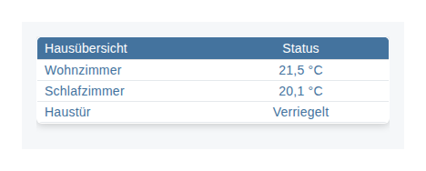
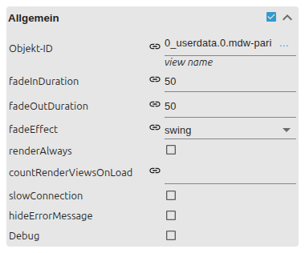

# Advanced View in Widget

[Anwenderhandbuch](../README.md) › [Widget-Katalog](README.md) · [English](../../en/widgets/html-widgets.md)

Ein Child-View-Container, der komplette VIS-2-Ansichten einbettet und per State
auswählt.

Template-IDs: `tplVis2-materialdesign-view-in-widget` und
`tplVis2-materialdesign-view-in-widget8`.

## Editor-Einstellungen

Der Screenshot zeigt die Gruppe **Allgemein**. Nicht aufgeführte Einstellungen
sind selbsterklärend.

**Allgemein**

- **Objekt-ID** – der State, dessen Wert die eingebettete Ansicht auswählt.
- **Ansichten** – die anzeigbaren VIS-2-Ansichten.
- **Einblenden / Ausblenden** – Übergang beim Wechsel zwischen Ansichten.
- **Vorrendern** – Ansichten optional geladen halten, damit der Wechsel sofort erfolgt.

Die `8`-Variante ergänzt indizierte State-Wert-zu-View-Einträge und
Persistenzeinstellungen für bis zu acht Zuordnungen.

Sollen mehrere Child Views gleichzeitig angeordnet werden, stattdessen
[Responsives Layout](responsive-layout.md) verwenden.
