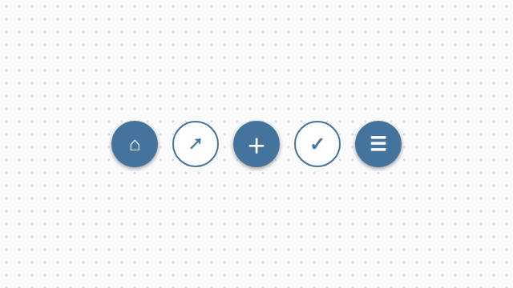
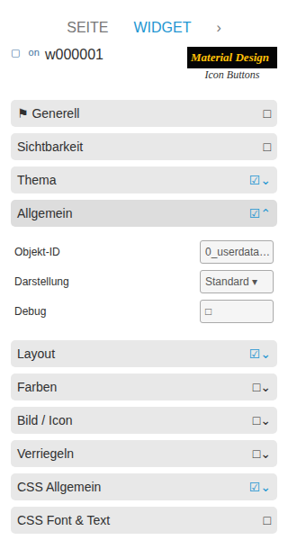

# Icon-Buttons

[Zurück zur README](../../../README.md#widget-documentation)

Kompakte VIS-2-Buttons ohne Beschriftung für Navigation, Links, State,
Multi-State, Addition, Toggle und einen kreisförmigen Wert-Slider.

Template-IDs beginnen mit `tplVis2-materialdesign-Icon-Button-`, gefolgt von
`Navigation`, `Link`, `State`, `State-Multi`, `Adition`, `Toggle` oder `Slider`.

## Editor-Einstellungen

<table>
<tr><td></td>
<td><ul><li>Objekt, Ansicht oder URL unter <b>Allgemein</b> wählen.</li><li>Icon, Farben und Größe unter <b>Bild / Icon</b> einstellen.</li><li>Die Slider-Variante ergänzt Wertebereich, Bogen, Breite und Farben.</li></ul></td></tr>
</table>

Unterstützt werden Material-Design-Iconnamen, lokale Bilder, URLs und Data-URLs.
