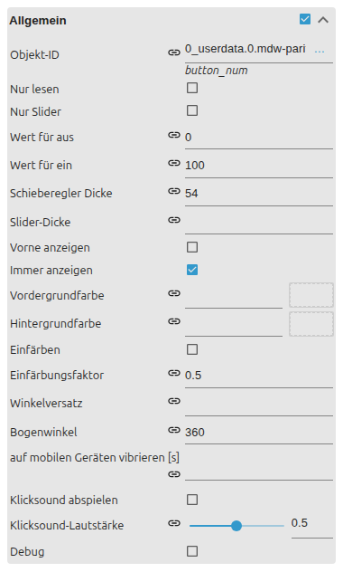

# Icon-Buttons

[Anwenderhandbuch](../README.md) › [Widget-Katalog](README.md) · [English](../../en/widgets/icon-buttons.md)

Kompakte VIS-2-Buttons ohne Beschriftung für Navigation, Links, State,
Multi-State, Addition, Toggle und einen kreisförmigen Wert-Slider.

Template-IDs beginnen mit `tplVis2-materialdesign-Icon-Button-`, gefolgt von
`Navigation`, `Link`, `State`, `State-Multi`, `Adition`, `Toggle` oder `Slider`.

## Editor-Einstellungen

Die Screenshots zeigen einen normalen Icon-Button und die kreisförmige Variante
*Slider*. Nicht aufgeführte Einstellungen sind selbsterklärend.

**Allgemein** – die Aktionsfelder entsprechen der jeweiligen
[Button](buttons.md)-Variante (Zielansicht, URL, Objekt-ID und Wert, …).

**Bild / Icon**

- **Bild** – Material-Design-Iconname oder Bildquelle.
- **Icon-Farbe / Ein-Zustand-Farbe** – einfarbiges Icon umfärben; eine eigene Farbe kann den Ein-Zustand markieren.
- **Icon-Größe** – Größe des Icons im runden Button.

Die Variante **Slider** macht aus dem Button einen kreisförmigen Wert-Slider:

- **nur Slider** – Wertsteuerung ohne Klickaktion.
- **Wert aus / ein** – auf den Bogen abgebildeter Wertebereich.
- **Winkelversatz / Bogen** – wo der Bogen beginnt und wie weit er verläuft.
- **Slider-Breite / -Stärke** – Geometrie des Bogens.
- **Vordergrund-/Hintergrundfarbe** und **im Vordergrund / immer zeigen** – Bogenfarben und Sichtbarkeit.

Unterstützt werden Material-Design-Iconnamen, lokale Bilder, URLs und Data-URLs.
