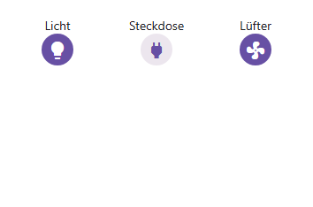
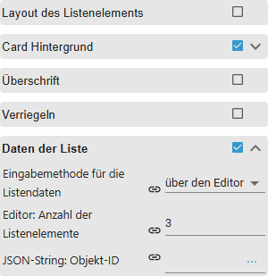
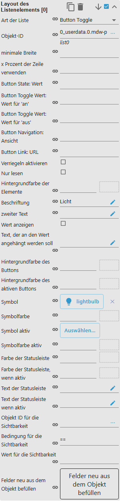

# IconList

[Anwenderhandbuch](../README.md) › [Widget-Katalog](README.md) · [English](../../en/widgets/iconlist.md)

Zeigt zustandsabhängige Icons in einem responsiven VIS-2-Raster. Daten werden im
Editor eingegeben oder aus JSON gelesen. Template-ID:
`tplVis2-materialdesign-Icon-List`.

## Editor-Einstellungen

Die Screenshots zeigen die Datengruppen und das Raster-Layout. Nicht aufgeführte
Einstellungen sind selbsterklärend.

**Daten der Liste**

- **Eingabemethode für die Listendaten** – `über den Editor` oder `JSON-String`.
- **Editor: Anzahl der Listenelemente** – wie viele indizierte Eintragsgruppen es gibt.
- **Objekt-ID** – der State mit dem JSON-Array, nur bei der Methode `JSON-String`.

Jede Zelle wird in ihrer eigenen indizierten Gruppe **Layout des Listenelements [n]** konfiguriert.
Anders als bei der [Liste](list.md) hat **jede Zelle ihre eigene Art**:

- **Art der Liste** – `Text`, `Button State`, `Button Toggle`,
  `Button Toggle Wert: ist nur aktiviert, wenn …`,
  `Button Toggle Wert: ist nur deaktiviert, wenn …`, `Button Navigation` oder
  `Button Link`. Ohne passenden Vergleichswert gilt eine Zelle als aktiv, sobald
  ihr State `true` ist.
- **Objekt-ID** – der die Zelle steuernde State.
- **Nur lesen** – zeigt den Zustand, schreibt aber nichts.
- **Symbol / Symbolfarbe** und **Symbol aktiv / Symbolfarbe aktiv** – Aus- und Ein-Zustand des Icons; ohne Aktiv-Werte bleiben die normalen stehen.
- **Beschriftung / zweiter Text** – Texte an der Zelle.
- **Wert anzeigen** (Vorgabe an) blendet den State-Wert ein, **Text, der an den Wert angehängt werden soll** hängt eine Einheit an.
- **Farbe der Statusleiste (wenn aktiv) / Text der Statusleiste (wenn aktiv)** – schmaler Streifen am unteren Rand der Zelle.
- **minimale Breite** und **x Prozent der Zeile verwenden** – Breite dieser einen Zelle abweichend vom Raster.
- **Objekt ID für die Sichtbarkeit**, **Bedingung für die Sichtbarkeit** und **Wert für die Sichtbarkeit** – blenden die Zelle aus, solange die Bedingung nicht zutrifft. Erlaubt sind `==` (Vorgabe), `!=`, `<`, `<=`, `>`, `>=`, `consist`, `not consist`, `exist` und `not exist`. Ohne Objekt-ID bleibt die Zelle sichtbar.
- **Verriegeln aktivieren** – diese Zelle muss erst entsperrt werden, bevor sie schaltet.

**Verriegeln** (listenweit)

- **automatisch Verriegeln nach [s]** – Vorgabe 10 Sekunden.
- **Symbol**, Position, Größe und Farbe des Schlosses.
- **Graufilter, wenn verriegelt** (Vorgabe 30 %) und **Graufilter nur auf das Symbol anwenden**.

Die Rasteranordnung liegt in der Gruppe **Allgemein**:

- **Elemente umbrechen** / **Anzahl der maximalen Listenelemente pro Zeile** – wie Zellen in Zeilen fließen.
- **Abstand zwischen Elementen** – Abstand zwischen den Zellen.

In der Gruppe **Layout des Listenelements** liegen **Layout** (`standard`, `Karte`,
`cardOutlined`), **Layout der Elemente** (`vertikal` oder `horizontal`, Icon über
oder neben dem Text), **Bildhöhe**, **minimale Breite / Höhe**, **Layout der
Schaltflächen** (`Rund`, `rechteckig`, `Komplett`) sowie Schriften und Farben der
drei Textzeilen.

Symbole akzeptieren Material-Design-Iconnamen und Bildquellen.

Bei der Methode `JSON-String` liefert der State ein Array von Objekten. Die
Schlüssel weichen von den Editor-Feldern ab: `objectId`, `text`, `subText`,
`image`, `imageColor`, `imageActive`, `imageActiveColor`, `background`,
`buttonBackgroundColor`, `buttonBackgroundActiveColor`, `buttonStateValue`,
`buttonToggleValueTrue`, `buttonToggleValueFalse`, `buttonNavView`, `buttonLink`;
`listType`, `minWidth`, `usePercentOfRow`, `readOnly`, `showValueLabel`,
`valueAppendix`, `statusBarColor`, `statusBarColorActive`, `statusBarText`,
`statusBarTextActive`, `lockEnabled`, `visibilityOid`, `visibilityCondition` und
`visibilityConditionValue` heißen wie im Editor. Über 100 Einträge werden
abgeschnitten.

## Gestaltungsstil

Die Stile **Klassisch** (links) und **Material 3** (rechts) nebeneinander, siehe
[Gestaltungsstil](../README.md#gestaltungsstil): die reine Textliste, Karte und
Karte outlined, Trenner inset, Switch- und Checkbox-Zeilen sowie die Icon-Liste.

Dieselben Widgets bei eingeschaltetem Dark-Theme:

