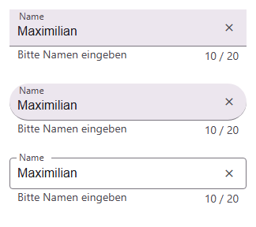
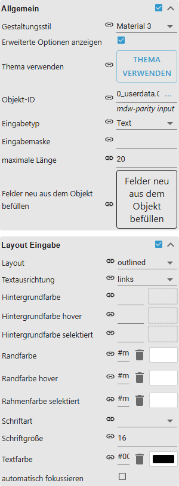
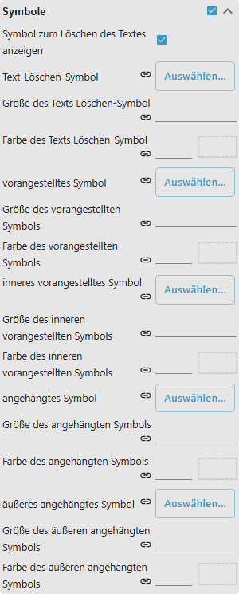
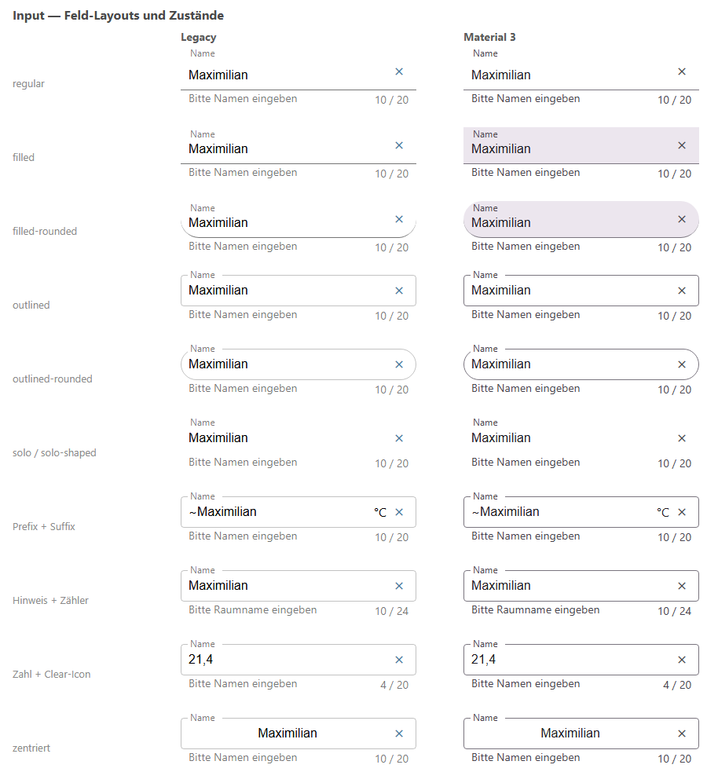
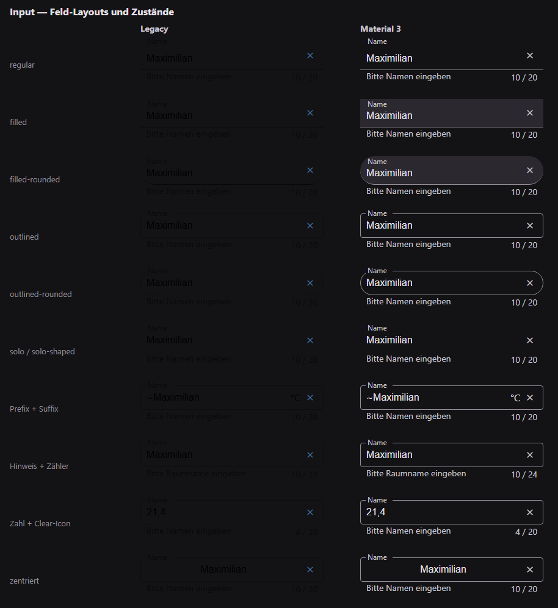

# Eingabe

[Anwenderhandbuch](../README.md) › [Widget-Katalog](README.md) · [English](../../en/widgets/input.md)

Ein natives VIS-2-Feld zur Eingabe von Text oder Zahlen.
Template-ID: `tplVis2-materialdesign-Input`.

## Editor-Einstellungen

Der Screenshot zeigt die Gruppen **Allgemein** und **Layout Eingabe**
aufgeklappt. Nicht aufgeführte Einstellungen sind selbsterklärend.

**Allgemein**

- **Objekt-ID** – der State, in den die Eingabe geschrieben wird.
- **Eingabetyp** – `Text`, `Zahl`, `Datum`, `Zeit` oder `Maske`. Bei `Zahl` wird
  eine Zahl geschrieben, sonst Text; ein leer gemachtes Zahlenfeld schreibt
  nichts, statt eine 0 in den State zu setzen.
- **Eingabemaske** – nur beim Eingabetyp `Maske`. Platzhalter: `#` Ziffer,
  `S` Buchstabe, `A` Buchstabe groß, `a` Buchstabe klein, `N` Ziffer oder
  Buchstabe, `X` beliebiges Zeichen. Jedes andere Zeichen ist ein fester
  Trenner, `##:##` ergibt also eine Uhrzeit-Eingabe.
- **maximale Länge** – begrenzt die Eingabe und liefert dem Zähler den Wert
  hinter dem Schrägstrich.

`Text`, `Zahl` und `Maske` schreiben beim Verlassen des Felds oder mit Enter,
`Datum` und `Zeit` sofort nach der Auswahl.

**Layout Eingabe**

- **Layout** – `regular`, `solo`, `solo-rounded`, `solo-shaped`, `filled`,
  `filled-rounded`, `filled-shaped`, `outlined`, `outlined-rounded` oder
  `outlined-shaped`.
- **Textausrichtung** – `links`, `Mitte` oder `rechts` für den eingegebenen Text.
- **automatisch fokussieren** – das Feld bekommt beim Laden der Ansicht den Fokus.
- Hintergrund-, Rahmen- und Textfarben gelten je für den normalen, überfahrenen
  und ausgewählten Zustand.

**Beschriftung der Eingabe**

- **Text** – die schwebende Beschriftung über dem Feld.
- **Versatz x / Versatz y** – verschieben sie, wenn sie mit einem Symbol kollidiert.

**Anhänge der Eingabe**

- **vorangestellter Text / angehängter Text** – fester Text links bzw. rechts im
  Feld, etwa eine Einheit. Er wird nicht in den State geschrieben.

**Untertext der Eingabe**

- **Text** – Hinweiszeile unter dem Feld.
- **immer anzeigen** – abgeschaltet erscheint der Hinweis nur, solange das Feld
  den Fokus hat.

**Zählerlayout**

- **Zähler anzeigen** – zeigt unten rechts die Zeichenzahl, mit gesetzter
  **maximaler Länge** als `12 / 30`.

**Symbole**

Für das **Text-Löschen-Symbol**, das **vorangestellte**, das **innere
vorangestellte**, das **angehängte** und das **äußere angehängte Symbol** lässt
sich je ein Icon oder ein Bild samt Größe und Farbe wählen.

Für die Auswahl aus einer Werteliste nutze stattdessen das [Select](select.md)-Widget.

## Gestaltungsstil

Die Stile **Klassisch** (links) und **Material 3** (rechts) nebeneinander, siehe
[Gestaltungsstil](../README.md#gestaltungsstil): die Layouts regular, filled,
filled-rounded, outlined, outlined-rounded und solo, Prefix/Suffix, Hinweis und
Zähler, Zahlenfeld mit Clear-Icon und zentrierten Text.

Dieselben Widgets bei eingeschaltetem Dark-Theme:

