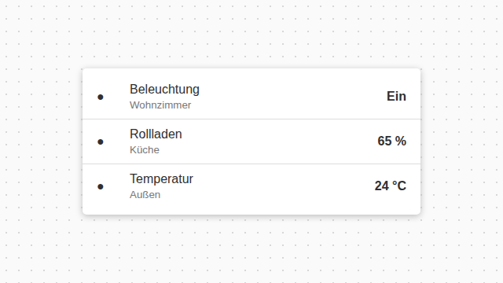
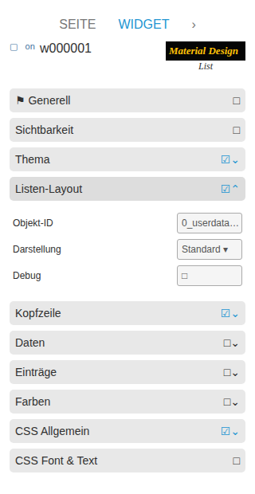

# Liste

[Zurück zur README](../../../README.md#widget-documentation)

Konfigurierbare VIS-2-Liste mit Textzeilen, Buttons, Switches oder Checkboxen.
Zeilen kommen aus Editor-Einträgen oder einem JSON-State. Template-ID:
`tplVis2-materialdesign-List`.



## Editor-Einstellungen

<table>
<tr><td></td>
<td><ul><li><b>Listentyp:</b> Text, State-/Toggle-/Navigations-/Link-Button, Switch oder Checkbox.</li><li><b>Datenmethode:</b> Editor-Einträge oder JSON-Objekt-State.</li><li><b>Listenlayout:</b> Standard, Karte oder umrandete Karte.</li><li><b>Einträge:</b> Objekt-ID, Texte, Icon, Aktion und Trenner je Zeile.</li></ul></td></tr>
</table>

```json
[{ "objectId": "0_userdata.0.light", "text": "Licht", "subText": "Wohnzimmer", "image": "lightbulb" }]
```
