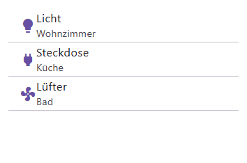
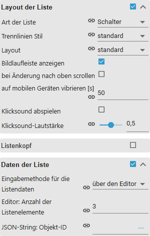
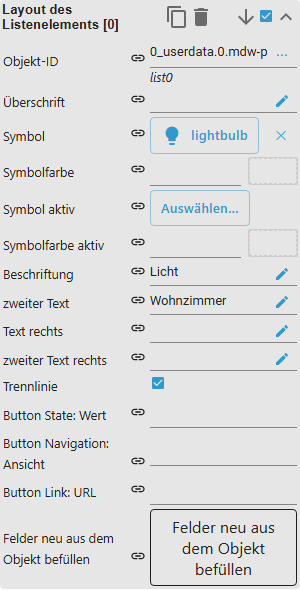
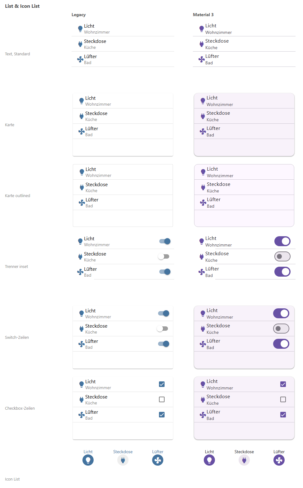
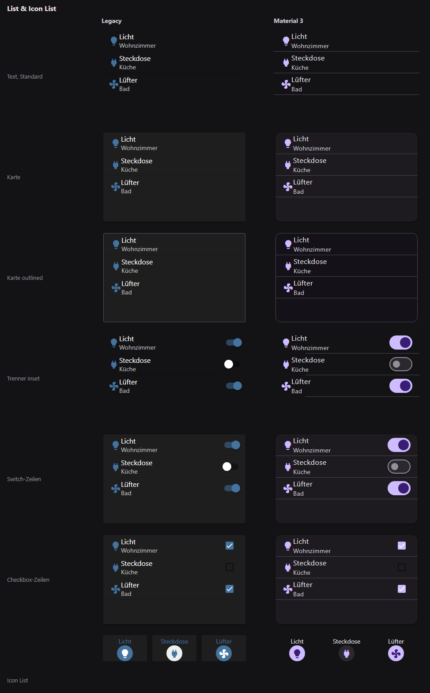

# Liste

[Anwenderhandbuch](../README.md) › [Widget-Katalog](README.md) · [English](../../en/widgets/list.md)

Konfigurierbare VIS-2-Liste mit Textzeilen, Buttons, Switches oder Checkboxen.
Zeilen kommen aus Editor-Einträgen oder einem JSON-State. Template-ID:
`tplVis2-materialdesign-List`.



## Editor-Einstellungen

Die Screenshots zeigen die listenweiten Gruppen und einen indizierten Zeileneintrag.
Nicht aufgeführte Einstellungen sind selbsterklärend.



**Layout der Liste**

- **Art der Liste** – gilt für alle Zeilen: `Text`, `Button State`, `Button Toggle`,
  `Button Toggle (schreibgeschützt)`, `Button Navigation`, `Button Link`, `Schalter`,
  `Schalter (schreibgeschützt)`, `Kontrollkästchen` oder `Checkbox (nur lesen)`. Die
  schreibgeschützten Varianten zeigen den Zustand an, schreiben aber nichts.
- **Layout** – `standard`, `Karte` oder `cardOutlined` (umrandete Karte).
- **Trennlinien Stil** – `standard`, `padded` oder `inset`.

**Listenkopf**

- **Überschrift** – Kopfzeile über der Liste, mit eigener Ausrichtung, Höhe, Innenabständen, Farbe, Schrift und Symbol. Leer bleibt der Kopf weg.

**Daten der Liste**

- **Eingabemethode für die Listendaten** – `über den Editor` (indizierte Zeilengruppen) oder `JSON-String` (ein State liefert alle Zeilen).
- **Editor: Anzahl der Listenelemente** – wie viele indizierte Zeilengruppen es gibt.
- **Objekt-ID** – der State mit dem JSON-Array, nur bei der Methode `JSON-String`.

Jede Zeile wird in ihrer eigenen indizierten Gruppe **Layout des Listenelements [n]** konfiguriert:



- **Objekt-ID** – der von der Zeile gesteuerte State (Schalter, Kontrollkästchen, Button).
  Sie zeigt keinen Wert an — dafür eine Bindung in einen der Texte schreiben,
  siehe [Werte in Texten anzeigen](../README.md#werte-in-texten-anzeigen).
- **Überschrift** – Gruppenüberschrift über dieser Zeile, um eine Liste in Abschnitte zu teilen.
- **Beschriftung / zweiter Text / Text rechts / zweiter Text rechts** – die vier Texte einer Zeile.
- **Symbol / Symbolfarbe** und **Symbol aktiv / Symbolfarbe aktiv** – Zeilensymbol, umgeschaltet auf den Aktiv-Zustand. Ohne aktives Symbol bleibt das normale stehen.
- **Trennlinie** – Trennlinie unter dieser Zeile.
- **Button State: Wert** – der Wert, den eine `Button State`-Zeile schreibt.
- **Button Navigation: Ansicht** – Ziel-View einer `Button Navigation`-Zeile.
- **Button Link: URL** – Adresse einer `Button Link`-Zeile.

Bei der Methode `JSON-String` liefert der State ein Array von Objekten. Die
Schlüssel heißen dort anders als die Editor-Felder:

```json
[{ "objectId": "0_userdata.0.light", "text": "Licht", "subText": "Wohnzimmer", "image": "lightbulb" }]
```

| Schlüssel | Editor-Feld |
|---|---|
| `objectId` | Objekt-ID |
| `text` / `subText` | Beschriftung / zweiter Text |
| `rightText` / `rightSubText` | Text rechts / zweiter Text rechts |
| `image` / `imageColor` | Symbol / Symbolfarbe |
| `imageActive` / `imageActiveColor` | Symbol aktiv / Symbolfarbe aktiv |
| `header` | Überschrift |
| `showDivider` | Trennlinie |
| `buttonStateValue` | Button State: Wert |
| `buttonNavView` | Button Navigation: Ansicht |
| `buttonLink` | Button Link: URL |

Nicht gesetzte Schlüssel bleiben leer; ohne `text` steht `Item n` in der Zeile.
Über 100 Einträge werden abgeschnitten, und ein ungültiges JSON zeigt statt der
Liste eine rote Fehlerzeile.

## Gestaltungsstil

Die Stile **Klassisch** (links) und **Material 3** (rechts) nebeneinander, siehe
[Gestaltungsstil](../README.md#gestaltungsstil): die reine Textliste, Karte und
Karte outlined, Trenner inset, Switch- und Checkbox-Zeilen sowie die Icon-Liste.



Dieselben Widgets bei eingeschaltetem Dark-Theme:


