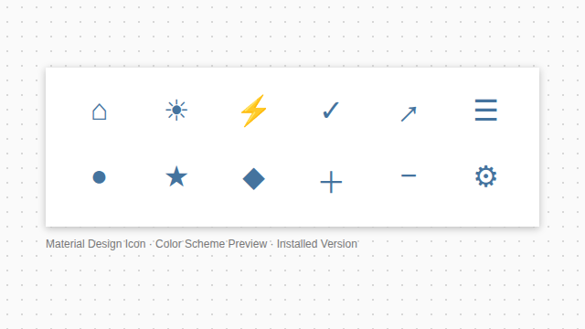
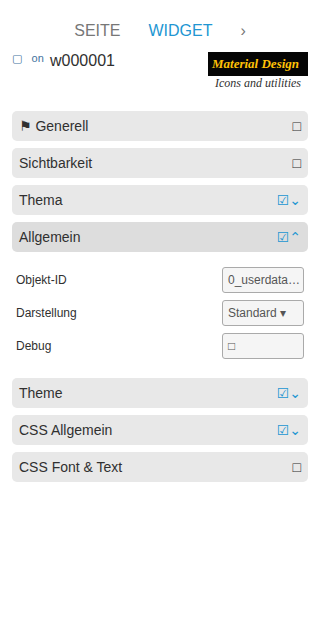

# Material-Design-Icons und Hilfswidgets

[Zurück zur README](../../../README.md#widget-documentation)

Native VIS-2-Hilfswidgets für ein einzelnes Icon, eine Farbschema-Vorschau und
die installierte Paketversion.

Template-IDs: `tplVis2-materialdesign-Icon`,
`tplVis2-materialdesign-ColorScheme-Preview` und
`tplVis2-materialdesign-Installed-Version`.

## Editor-Einstellungen

<table>
<tr><td></td>
<td><ul><li><b>Icon:</b> Material-Design-Icon oder Bild, Größe und Farbe wählen.</li><li><b>Farbschema-Vorschau:</b> zeigt die verfügbaren Material-Design-Paletten.</li><li><b>Installierte Version:</b> zeigt die paketierte Widget-Version.</li></ul></td></tr>
</table>

Icon-/Bildfelder akzeptieren Material-Design-Namen, gängige Bildpfade, HTTP(S)-
URLs und Data-URLs. SVG-Masken unterstützen eine einzelne konfigurierte Farbe.
