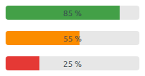
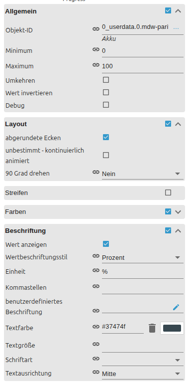

# Fortschritt

[Anwenderhandbuch](../README.md) › [Widget-Katalog](README.md) · [English](../../en/widgets/progress.md)

Linearer VIS-2-Fortschrittsbalken für numerische oder boolesche Zustände.
Template-ID: `tplVis2-materialdesign-Progress`.

## Editor-Einstellungen

Der Screenshot zeigt die Gruppen **Allgemein**, **Layout** und **Beschriftung**
aufgeklappt. Nicht aufgeführte Einstellungen sind selbsterklärend.

**Allgemein**

- **Min / Max** – bildet den State-Wert auf 0–100 Prozent ab.
- **Umkehren** – füllt von der gegenüberliegenden Seite.
- **Wert invertieren** – zeigt den verbleibenden statt des erreichten Prozentwerts.

**Layout**

- **abgerundet** – rundet die Balkenenden.
- **unbestimmt** – Daueranimation, die den Wert ignoriert (Busy-Anzeige).
- **Drehung** – dreht den gesamten Balken um einen Winkel.

**Beschriftung**

- **Beschriftungsstil** – Prozent, Rohwert oder eigene Vorlage.
- **Einheit** – an den Wert angehängter Text.
- **eigene Beschriftung** – freier Text/Binding, wenn der Stil *eigene* ist.

Die Gruppe **Streifen** aktiviert und gestaltet ein Streifenmuster. Unter
**Farben** ersetzen zwei optionale Schwellenfarben (je mit Bedingung) die
Standardfarbe, sobald der Wert sie überschreitet.
