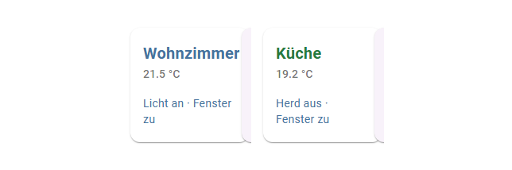
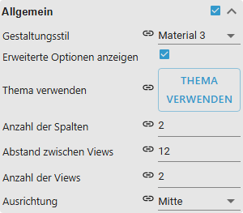

# Responsives Layout

[Anwenderhandbuch](../README.md) › [Widget-Katalog](README.md) · [English](../../en/widgets/responsive-layout.md)

Responsive VIS-2-Container für Masonry Views, Grid Views und zustandsgesteuerte
eingebettete Ansichten.

Template-IDs: `tplVis2-materialdesign-Masonry-Views`,
`tplVis2-materialdesign-Grid-Views`, `tplVis2-materialdesign-view-in-widget`
und `tplVis2-materialdesign-view-in-widget8`.

## Editor-Einstellungen

Der Screenshot zeigt die Gruppe **Allgemein** und einen indizierten
**View**-Eintrag des Masonry-Containers. Nicht aufgeführte Einstellungen sind
selbsterklärend.

**Allgemein** (Masonry)

- **Anzahl der Spalten** (Vorgabe 3, höchstens 12) und **Abstand zwischen
  Views** – das Grundraster auf dem Desktop.
- **Anzahl der Views** – wie viele indizierte Gruppen **Ansicht [n]** existieren,
  Vorgabe 3.
- **Ausrichtung** – `left`, `center` (Vorgabe), `right` oder `justify` für den
  Inhalt der Spalten.

**Allgemein** (Grid) hat statt der Spaltenzahl **Anzahl verwendete Spalten** von
1 bis 12 als Vorgabe für alle Views sowie **Vertikale Ausrichtung** und
**horizontale Ausrichtung**. Grid rechnet immer in einem 12er-Raster: eine View
mit Spannweite 3 belegt ein Viertel der Breite.

Die Gruppen **Handy Einstellungen** und **Tablet Einstellungen** erscheinen erst
mit dem Schalter **Erweiterte Optionen anzeigen**. Sie setzen je Breakpoint
(Hoch- und Querformat) die Umschaltbreite, bei Masonry die Spaltenzahl und den
Abstand, bei Grid die Spannweite. Vorgaben: Handy hochkant bis 393 px (1 Spalte),
quer bis 754 px (2), Tablet hochkant bis 768 px (2), quer bis 1024 px (3),
darüber der Desktop-Wert.

**Ansicht [n]**

- **Ansicht** – die eingebettete VIS-2-Ansicht. Ein leeres Feld zeigt einen
  gestrichelten Platzhalter.
- **Höhe der View** – feste Höhe; leer heißt, die Kachel misst ihren Inhalt
  selbst. **Breite der View** gibt es nur bei Masonry, **Anzahl verwendete
  Spalten** (samt den vier Handy-/Tablet-Spannweiten) nur bei Grid.
- **Sortierung** – Reihenfolge im Raster; ohne Angabe zählt der Index.
- **sichtbar, wenn Auflösung größer als** / **kleiner als** – blendet die View
  außerhalb dieser Widget-Breite aus. Beide Felder sind optional.
- **Objekt ID für die Sichtbarkeit**, **Bedingung für die Sichtbarkeit** (`==`,
  `!=`, `<=`, `>=`, `<`, `>`, `consist`, `not consist`, `exist`, `not exist`) und
  **Wert für die Sichtbarkeit** – die erfüllte Bedingung **zeigt** die View:
  `==` mit `1` heißt „nur zeigen, wenn der State `1` ist“. Bis 1.0.0 war das
  vertauscht; wer die Bedingung damals umgedreht hat, dreht sie jetzt zurück.

**Advanced View** wählt per State eine einzelne eingebettete Ansicht; siehe
[Advanced View in Widget](html-widgets.md).

Die native VIS-2-Child-View-Funktion bettet Inhalte ein, ohne die aktive
Hauptansicht zu wechseln.

**Auswahlhilfe:** Masonry oder Grid verwenden, wenn mehrere Views gleichzeitig
responsiv angeordnet werden sollen. [Advanced View in Widget](html-widgets.md)
verwenden, wenn ein State genau eine Child View auswählt.
