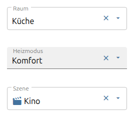
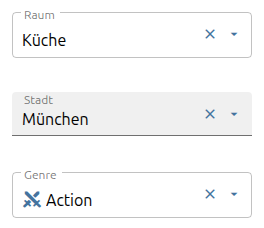
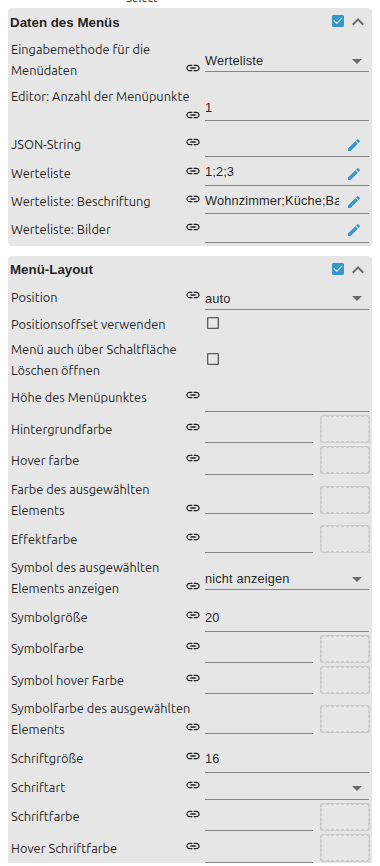

# Select und Autocomplete

[Anwenderhandbuch](../README.md) › [Widget-Katalog](README.md) · [English](../../en/widgets/select.md)

Native VIS-2-Dropdowns zur Wertauswahl. Autocomplete verhält sich wie Select,
filtert die Einträge aber zusätzlich beim Tippen.

Template-IDs: `tplVis2-materialdesign-Select` und `tplVis2-materialdesign-Autocomplete`.

Autocomplete nutzt dieselben Einstellungen, filtert die Liste aber beim Tippen —
praktisch bei langen Wertelisten wie Städten oder Titeln.

## Editor-Einstellungen

Der Screenshot zeigt die Menü-Gruppen aufgeklappt. Nicht aufgeführte
Einstellungen sind selbsterklärend.

**Daten des Menüs**

- **Datenmethode** – *Werteliste*, *JSON-String*, *JSON-Objekt* oder *States des Objekts* (nutzt die enum-Werte des verknüpften Objekts).
- **Werteliste / Texte / Icons** – semikolongetrennte Listen, die die Einträge bilden, z. B. Werte `1;2;3`, Texte `Wohnzimmer;Küche;Bad`, Icons `sofa;silverware-fork-knife;shower`.

**Menü-Layout**

- **Listenposition / Versatz** – wo das Dropdown relativ zum Feld öffnet.
- **gewähltes Icon zeigen** – markiert den aktiven Eintrag mit einem Haken.
- **beim Leeren öffnen** – öffnet die Liste nach dem Löschen erneut.

**Menüpunkt**

- Pro Eintrag **Wert**, **Text**, **Untertext**, **Icon** und **Icon-Farbe**, wenn die Einträge im Editor gepflegt werden.

Die Gruppe **Layout Eingabe** (outlined / filled / solo, rounded / shaped)
entspricht dem [Eingabe](input.md)-Widget. Beschriftungen, Löschen-/Aufklapp-Icons
und Farben liegen in eigenen optionalen Gruppen. JSON-Einträge können `value`,
`text`, `subText`, `icon` und `iconColor` nutzen.
