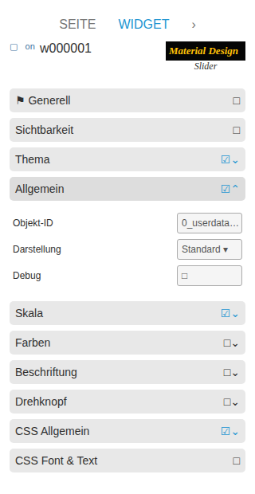

# Slider

[Zurück zur README](../../../README.md#widget-documentation)

Horizontaler oder vertikaler nativer VIS-2-Slider für numerische Zustände.
Template-ID: `tplVis2-materialdesign-Slider`.

## Editor-Einstellungen

<table>
<tr><td></td>
<td><ul><li><b>oid:</b> Wert-State; <b>oid-working</b> meldet optional die Bedienung.</li><li>Ausrichtung, Min, Max und Schritt unter <b>Allgemein</b>.</li><li><b>Skala:</b> Teilstriche und Texte.</li><li><b>Beschriftung:</b> Rohwert oder Prozent, Einheit und Grenztexte.</li><li><b>Thumb-Label:</b> aus, beim Ziehen oder immer sichtbar.</li></ul></td></tr>
</table>

**Nur lesen** zeigt den Wert, ohne Änderungen zu schreiben.
