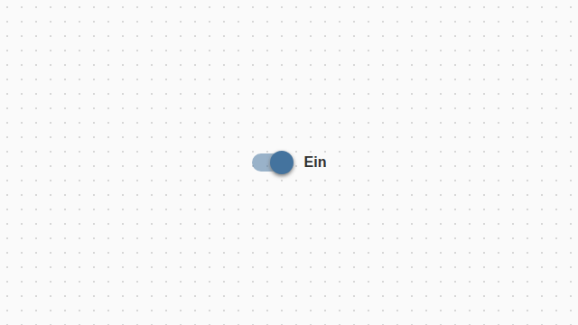
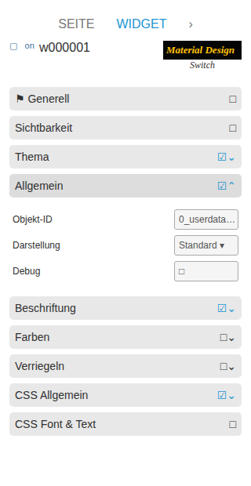

# Switch

[Zurück zur README](../../../README.md#widget-documentation)

Ein nativer Material-Design-Schalter für VIS 2, der boolesche oder eigene
Aus-/Ein-Werte liest und schreibt. Template-ID: `tplVis2-materialdesign-Switch`.

## Editor-Einstellungen

<table>
<tr><td></td>
<td><ul><li><b>Art der Umschaltung:</b> boolean schreibt true/false; value nutzt eigene Aus-/Ein-Werte.</li><li><b>Label-Position:</b> links, rechts oder aus.</li><li><b>Nur lesen:</b> Zustand anzeigen, aber nicht schreiben.</li></ul></td></tr>
</table>

**Farben** steuert Thumb, Track, Aktiv- und Hoverfarben. **Verriegeln** ergänzt
Entsperren und eine automatische Wiederverriegelung.
