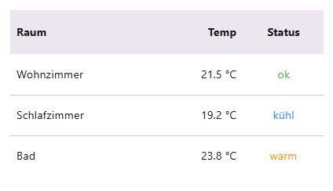
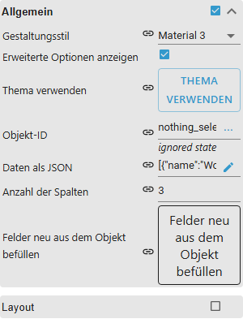
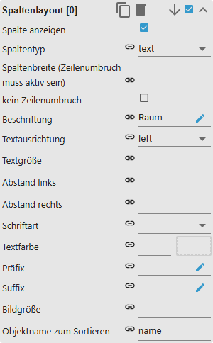
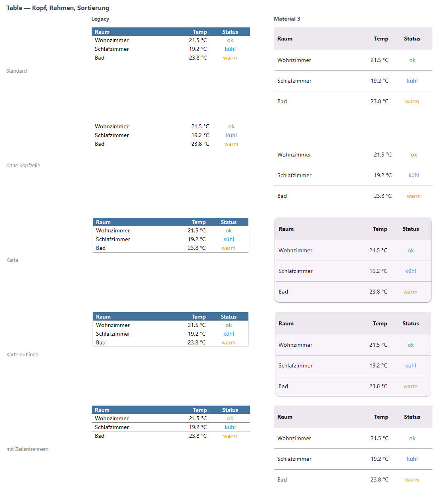
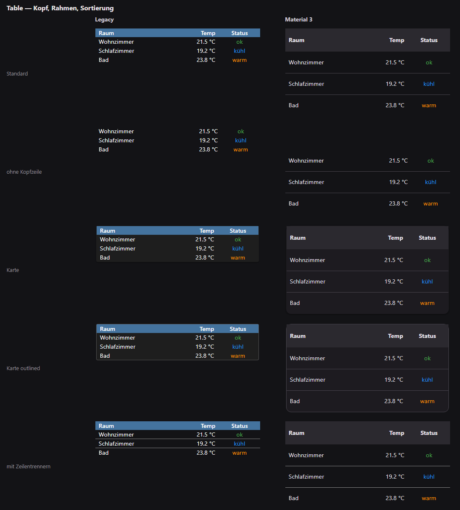

# Tabelle

[Anwenderhandbuch](../README.md) › [Widget-Katalog](README.md) · [English](../../en/widgets/table.md)

Native VIS-2-Tabelle für JSON-Zeilen mit konfigurierbaren indizierten Spalten.
Template-ID: `tplVis2-materialdesign-Table`.



## Editor-Einstellungen

Die Screenshots zeigen die Allgemein-/Layout-Gruppen und eine indizierte Spalte.
Nicht aufgeführte Einstellungen sind selbsterklärend.



**Allgemein**

- **Objekt-ID** – ein State, dessen Wert ein JSON-Array der Zeilen ist.
- **Daten als JSON** – dieselben Daten direkt als Text, wenn kein State sie liefert.
  Die Objekt-ID hat Vorrang, sobald sie gesetzt ist.
- **Anzahl der Spalten** – Anzahl der indizierten Gruppen **Spaltenlayout [n]**.

**Layout**

- **Tabellenlayout** – `standard`, `Karte` oder `cardOutlined` (Karte mit Rahmen
  statt Schatten).
- **Zeilenüberschrift anzeigen** – die Kopfzeile mit den Spaltenbeschriftungen.
- **feste Tabellenüberschrift** – die Kopfzeile bleibt beim Scrollen stehen.
- **abgerundeten Ecken** – runde Ecken; abgeschaltet bleibt der Rahmen eckig.
- **Zeilenüberschriftenhöhe / Zeilenüberschrift Textgröße / Zeilenüberschrift
  Schriftart** – gelten nur für die Kopfzeile, **Zeilenhöhe** nur für die Datenzeilen.

**Farben**

- **Hintergrundfarbe Zeile / Hintergrundfarbe ungerade Zeile** – ist die zweite
  Farbe gesetzt, wechseln sich beide zeilenweise ab; bleibt sie leer, gilt die
  erste für alle Zeilen.
- **Hintergrundfarbe Zeile Hover** – Farbe der Zeile unter dem Mauszeiger.
- **Trennlinie** – Linie zwischen den Zeilen; die letzte Zeile bekommt keine.
- **Rahmenfarbe** – Rahmen um die Tabelle.

Jede Spalte wird in ihrer eigenen indizierten Gruppe **Spaltenlayout [n]** konfiguriert:



- **Spalte anzeigen** – abgeschaltet fällt die Spalte weg, ohne die Nummerierung
  der übrigen zu verschieben.
- **Beschriftung** – Spaltenkopftext. Er benennt die Spalte nur, er wählt nicht
  aus, welche JSON-Eigenschaft sie zeigt.
- **Spaltentyp** – `Text` oder `Bild`. Bei `Bild` ist der Zellenwert eine URL,
  **Bildgröße** begrenzt die Breite.
- **Objektname zum Sortieren** – die JSON-Eigenschaft, nach der ein Klick auf
  diesen Spaltenkopf sortiert. Leer wird nach der Eigenschaft sortiert, die die
  Spalte selbst zeigt. Ein zweiter Klick dreht die Richtung.
- **Spaltenbreite (Zeilenumbruch muss aktiv sein) / Textausrichtung / kein
  Zeilenumbruch** – Spaltengröße und Textverhalten.
- **Präfix / Suffix** – Text um den Zellenwert. Beide dürfen `#[obj.name]`
  enthalten und setzen dort die Eigenschaft `name` derselben Zeile ein.

Die Spalten sind die Eigenschaften der **ersten** Zeile, in deren Reihenfolge:
**Spaltenlayout [0]** zeigt die erste Eigenschaft, **[1]** die zweite und so
weiter.

```json
[{ "geraet": "Temperatur", "raum": "Wohnzimmer", "wert": "22,4 °C" }]
```

Jede weitere Zeile wird gegen diese Spalten gelesen: eine Eigenschaft, die einer
Zeile fehlt, lässt ihre Zelle leer und verschiebt die übrigen Spalten nicht.

Die Tabelle zeigt nur, was in diesem JSON steht. Sollen einzelne Datenpunkte
untereinander erscheinen, ohne sie vorher in ein JSON zu schreiben, ist die
[Liste](list.md) mit Bindungen in den Zeilentexten der kürzere Weg, siehe
[Werte in Texten anzeigen](../README.md#werte-in-texten-anzeigen).

## Gestaltungsstil

Die Stile **Klassisch** (links) und **Material 3** (rechts) nebeneinander, siehe
[Gestaltungsstil](../README.md#gestaltungsstil): die Tabelle mit und ohne
Kopfzeile, abgerundet, mit fixiertem Kopf und mit Zeilentrennern.



Dieselben Widgets bei eingeschaltetem Dark-Theme:


