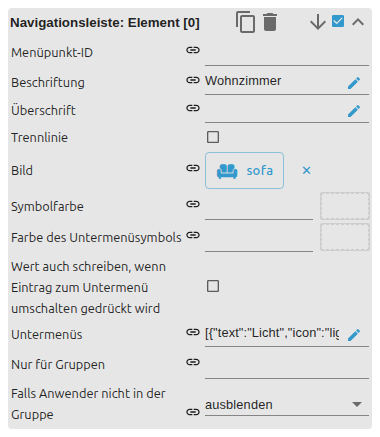

# Top App Bar

[Anwenderhandbuch](../README.md) › [Widget-Katalog](README.md) · [English](../../en/widgets/top-app-bar.md)

VIS-2-Top-App-Bar mit responsivem Navigation Drawer und indizierten Menüeinträgen.
Template-ID: `tplVis2-materialdesign-TopAppBar-Navigation`.

## Editor-Einstellungen

Die Screenshots zeigen die Allgemein-/Bar-Gruppen sowie die Menüdaten und einen
Eintrag. Nicht aufgeführte Einstellungen sind selbsterklärend.

**Allgemein**

- **Objekt-ID** – erhält den gewählten Menü-Index; ein optionaler zweiter State erhält den **Namen** des gewählten Eintrags.
- **Anzahl Menüeinträge** – Anzahl der indizierten Eintragsgruppen (Editor-Methode).
- **Standard- / Standardwert deaktivieren** – welcher Eintrag vorausgewählt ist, oder keiner.

**Top App Bar Layout**

- **Layout** – Standard, dicht oder kurz.
- **Titel / gewählten Eintrag als Titel zeigen** – fester Titel oder der aktive Menüeintrag als Titel.
- **Farben** – Titel-, Hintergrund- und Icon-Farben.

Die Gruppe **Navigationsleiste: Layout** bestimmt den Drawer-Modus (modal,
permanent oder automatisch ab einer Bildschirmbreite), Drawer-Breite, Kopfzeile
und Sichtbarkeit der Beschriftungen.

Die Menüeinträge stammen aus den Daten- und Eintragsgruppen:

- **Datenmethode** – indizierte Editor-Einträge oder ein JSON-String.
- **Menü-ID** – der für diesen Eintrag geschriebene Wert.
- **Beschriftung / Kopfzeile / Trenner** – Eintragstext, Abschnittskopf-Flag und Trennlinie.
- **Icon + Farbe**, **Untermenüs** und **Berechtigungsgruppe / Sichtbarkeit** pro Eintrag.
