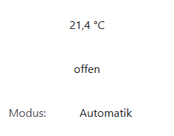
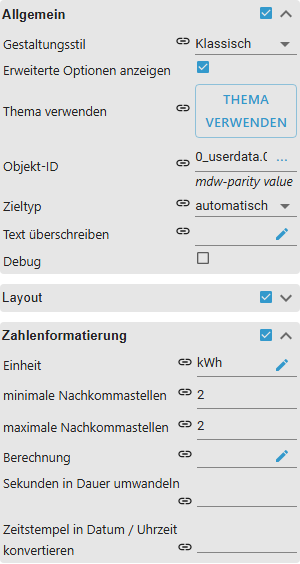
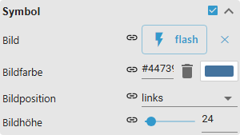
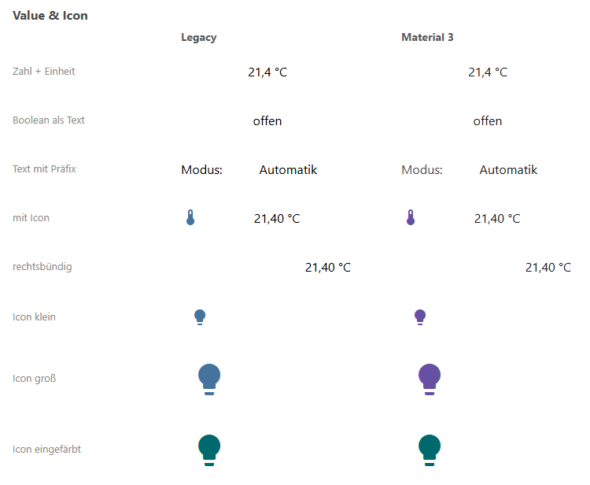
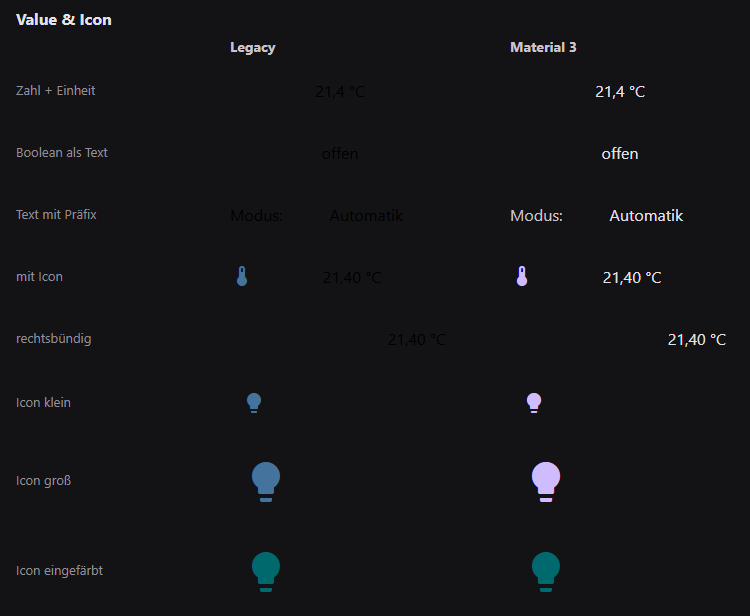

# Wertanzeige

[Anwenderhandbuch](../README.md) › [Widget-Katalog](README.md) · [English](../../en/widgets/value.md)

Zeigt einen ioBroker-Zustand als Text, Zahl, Bool-Wert oder verknüpften Wert an –
mit Formatierung, Präfix/Suffix und optionalem Icon. Template-ID:
`tplVis2-materialdesign-value`.

## Editor-Einstellungen

Die Screenshots zeigen die Gruppen, die die Ausgabe bestimmen. Nicht
aufgeführte Einstellungen sind selbsterklärend.

**Allgemein**

- **Zieltyp** – wie der State interpretiert wird: `automatisch`, Zahl, Text, boolesch oder *verknüpft* (klickbarer Wert, der das Objekt öffnet).
- **Präfix / Suffix** – fester Text vor / nach dem Wert (Einheit, Beschriftung).

**Zahlenformatierung**

- **Min./Max.-Nachkommastellen** – Anzahl der angezeigten Dezimalstellen.
- **Einheit** – an die Zahl angehängter Einheitentext.
- **Berechnung** – mathematischer Ausdruck, der vor der Anzeige auf den Wert angewendet wird (z. B. `x/1000` für Wh → kWh).
- **in Dauer / in Zeitstempel umwandeln** – eine Sekundenzahl als `hh:mm:ss` bzw. einen Zeitstempel als formatiertes Datum/Zeit darstellen.

**Symbol**

- **Bild** – Material-Design-Iconname, Bildpfad/URL oder Data-URL neben dem Wert.
- **Icon-Position** – vor oder nach dem Wert.
- **Icon-Farbe / -Höhe** – Umfärben (einfarbiges SVG) und Größe des Icons.

Eine eigene Gruppe **Logikwert Formatierung** erscheint, sobald der Zieltyp
boolesch ist: Sie enthält die **Texte für true / false** und eine **Bedingung**,
die bei nicht-booleschen Eingaben über den true/false-Zustand entscheidet. Der
Änderungseffekt hebt aktualisierte Werte kurz hervor.

## Gestaltungsstil

Die Stile **Klassisch** (links) und **Material 3** (rechts) nebeneinander, siehe
[Gestaltungsstil](../README.md#gestaltungsstil): Zahl mit Einheit, Boolean als
Text, Text mit Präfix, Wert mit Symbol, rechtsbündig sowie das Icon-Widget
klein, groß und eingefärbt.

Dieselben Widgets bei eingeschaltetem Dark-Theme:

