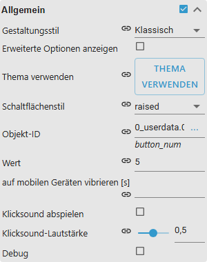
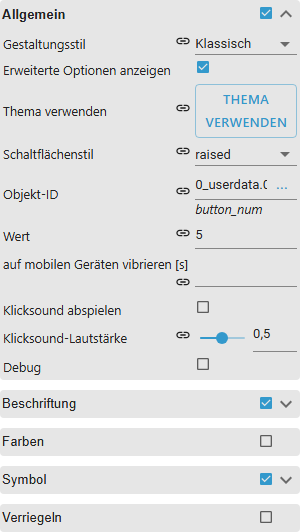

# Material Design Widgets – User guide

[Project overview](../../README.md) · [Deutsch](../de/README.md)

## Requirements

- ioBroker Admin 7.6.20 or newer
- Node.js 22 or newer
- an installed VIS 2 adapter
- a current Chromium-based browser or Firefox as target environment

A complete browser/runtime compatibility matrix has not been tested yet.

## Installation and quick start

1. Install **Material Design Widgets** (`vis2-materialdesign`) from the ioBroker
   Admin adapter list.
2. Open the VIS 2 editor and a project.
3. Open the **Material Design** widget set.
4. Drag a widget into the view and select it.
5. Configure its object ID and behaviour in the **WIDGET** tab.
6. Save the project and test it in runtime mode.

Use **Value** for a first test: select an object under `oid`, configure unit and
decimal places, then save the view.

## Use a theme

Theme use is optional:

1. Open the adapter configuration.
2. Configure light and dark colors, fonts and font sizes in the **Theme Editor**,
   then save.
3. Select a widget in the VIS 2 editor.
4. Choose **Theme → use theme** and confirm.

This places the matching theme references in the selected widget. Widget values
changed afterwards remain individual overrides. The global JavaScript script in
the adapter configuration is only needed when scripts must access theme values
directly.

## Design style

Every widget renders in one of two styles, selected in the **WIDGET** tab under
**General → design style**:

- **Classic** – the established Material Design 2-era look, the default.
- **Material 3** – Material 3 color roles, shape, type and state layers.
- **Project default** – follows the style set in the adapter's **Design** tab, so
  a whole project can be switched centrally.

Material 3 changes presentation only. Object ids, option names, values, write
behaviour, timers and navigation are identical in both styles, and setting a
widget back to `Classic` restores the old look exactly. Colors, fonts and sizes
you configured explicitly still win — Material 3 only fills in the values you
left empty, so clear those fields to let a widget follow the Material 3 palette.

Dark mode follows the same `vis2-materialdesign.0.colors.darkTheme` state the
classic style already uses. The **Design** tab derives the complete Material 3
scheme from one seed color; leave the seed empty for Google's baseline palette.

Each widget page shows both styles side by side in light and dark mode.

**show advanced options**, right below the style, reveals the rarely used option
groups of the selected widget. A widget that already carries such values shows
them without the switch.

## Choose a widget by task

- Switch and navigate: [Buttons](widgets/buttons.md),
  [Icon Buttons](widgets/icon-buttons.md), [Checkbox](widgets/checkbox.md),
  [Switch](widgets/switch.md)
- Enter values: [Input, Select and Autocomplete](widgets/input.md),
  [Slider](widgets/slider.md), [Slider Round](widgets/slider-round.md)
- Display values: [Value](widgets/value.md), [HTML Card](widgets/html-card.md),
  [Progress](widgets/progress.md)
- Display data: [List](widgets/list.md), [Table](widgets/table.md),
  [Charts](widgets/charts.md), [Calendar](widgets/calendar.md)
- Structure views: [Top App Bar](widgets/top-app-bar.md),
  [Responsive Layout](widgets/responsive-layout.md), [Dialog](widgets/dialog.md)

[Complete widget catalog](widgets/README.md)

## Troubleshooting

- **Widget set is missing:** verify that `vis2-materialdesign` and VIS 2 are
  installed, then reload the VIS 2 editor.
- **Theme remains unchanged:** save the adapter configuration, run
  **Theme → use theme** again and reload runtime mode.
- **Changes are hidden after reinstalling the same version:** perform a hard
  browser reload.
- **Widget does not write:** check whether the object is writable and whether
  read-only mode or widget locking is active.
- **List, table, calendar or chart is empty:** compare its JSON with the example
  on the widget page.

## Browser note

Vibration is not available in every browser or device. See the
[Vibration API compatibility table](https://developer.mozilla.org/en-US/docs/Web/API/Navigator/vibrate#browser_compatibility).

Report problems with adapter version, browser, affected widget and a screenshot
in the [issue tracker](https://github.com/typhosj/ioBroker.vis2-materialdesign/issues).
