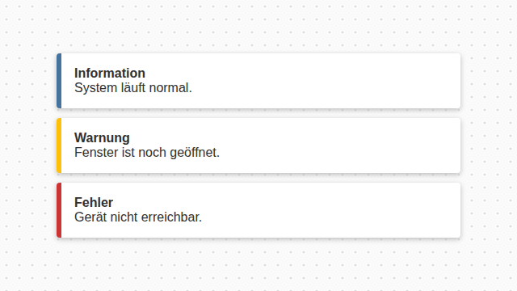
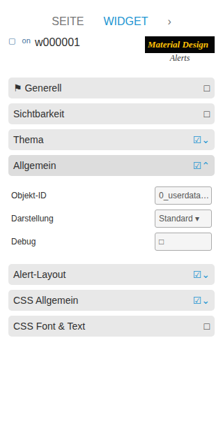

# Alerts

[Back to README](../../../README.md#widget-documentation)

Displays a JSON alert queue as Material Design notices. Alerts can be closed and
the updated queue is written back to the state. Template id:
`tplVis2-materialdesign-Alerts`.



## Editor settings

<table>
<tr><td></td>
<td><ul><li>Select the JSON object id and maximum number of visible alerts.</li><li>Choose normal, outlined or tile layout.</li><li>Configure density, elevation, border, typography and close icon.</li></ul></td></tr>
</table>

```json
[
    {
        "text": "Window is open",
        "icon": "alert-outline",
        "backgroundColor": "#fff8e1",
        "borderColor": "#ffc107",
        "iconColor": "#ffc107",
        "fontColor": "#333333"
    }
]
```

The state must contain a JSON array. Invalid JSON is shown as an error in the widget.
