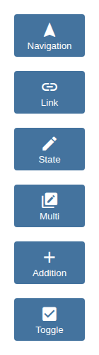
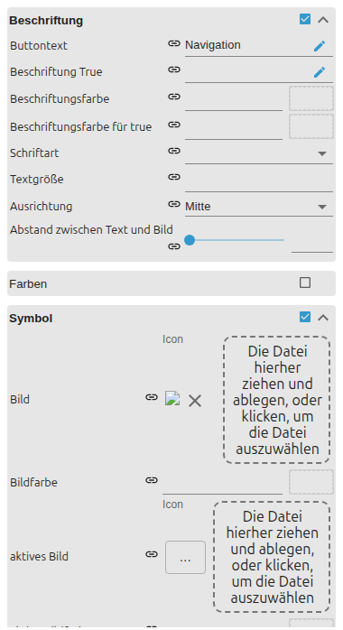

# Buttons Vertical

[User guide](../README.md) › [Widget catalog](README.md) · [Deutsch](../../de/widgets/buttons-vertical.md)

Vertical counterparts of all six button actions. Icon and label are arranged
vertically while action and state behaviour matches the normal buttons.

Template ids use the suffix `-vertical`, for example
`tplVis2-materialdesign-Button-Toggle-vertical`.

## Editor settings

The screenshot shows the **General**, **Label** and **Image / Icon** groups
expanded. Settings not listed below are self-explanatory. The editor UI follows
the ioBroker system language, so the screenshots are German.

**General** – the action fields match the corresponding normal
[button](buttons.md) (Navigation, Link, State, Multi State, Addition, Toggle).

**Label**

- **alignment** – vertical arrangement of icon and text.
- **distance between text and image** – spacing between the icon and the caption.
- **label width** – fixed caption width.

**Image / Icon**

- **image** – Material Design icon name or image source shown above the text.
- **icon color / on-state color** – recolor a single-color icon, with a separate color for the on state.

Optional **Colors**, **Feedback** and **Locking** groups override the theme and
protect the button against accidental activation.
