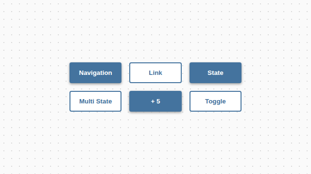
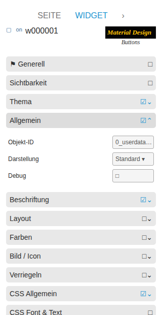

# Buttons

[Back to README](../../../README.md#widget-documentation)

Six native VIS 2 button variants for navigation, links, state writes, multi-state
writes, numeric addition and on/off toggling.

Template ids: `tplVis2-materialdesign-Button-Navigation`, `-Link`, `-State`,
`-State-Multi`, `-Adition` and `-Toggle`.

## Editor settings

Choose the variant in the **Material Design** widget set, select it and open the
**WIDGET** tab.

<table>
<tr><td></td>
<td><ul><li><b>Navigation:</b> select the target VIS 2 view.</li><li><b>Link:</b> enter a URL and choose whether it opens in a new window.</li><li><b>State:</b> select an object id and value.</li><li><b>Multi State:</b> configure the indexed object/value entries.</li><li><b>Addition:</b> set the increment and optional min/max limits.</li><li><b>Toggle:</b> use boolean or custom off/on values.</li></ul></td></tr>
</table>

The **Label**, **Image / Icon**, **Colors**, **Feedback** and **Locking** groups
control appearance and interaction. Icons accept Material Design icon names or
image sources. Locking requires an unlock click before the action runs.
