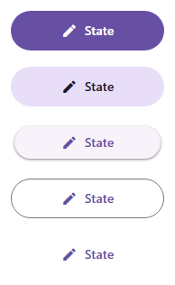
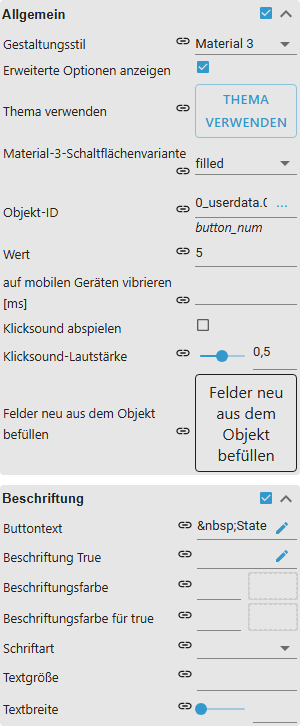
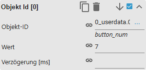
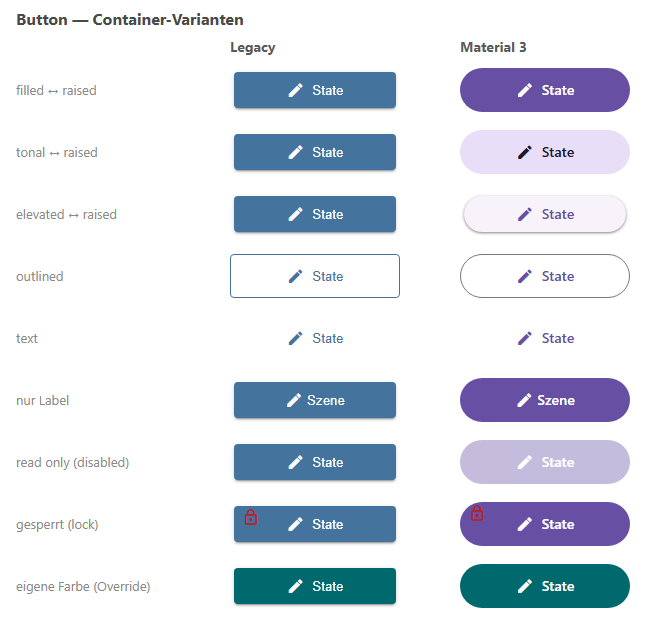
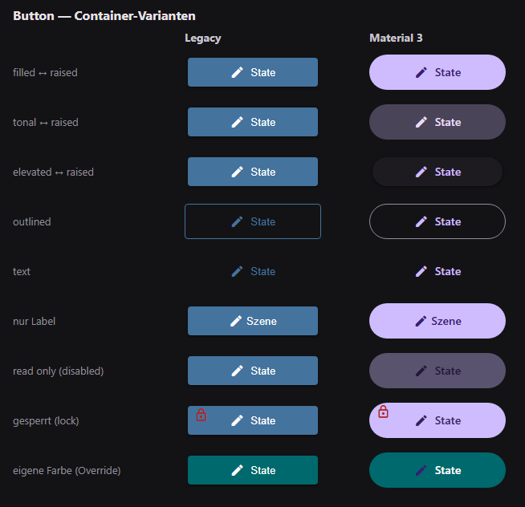

# Buttons

[User guide](../README.md) › [Widget catalog](README.md) · [Deutsch](../../de/widgets/buttons.md)

Six native VIS 2 button variants for navigation, links, state writes, multi-state
writes, numeric addition and on/off toggling.

Template ids: `tplVis2-materialdesign-Button-Navigation`, `-Link`, `-State`,
`-State-Multi`, `-Adition` and `-Toggle`.

## Editor settings

Pick the variant in the **Material Design** widget set, select it and open the
**WIDGET** tab. The screenshots use the *State* and *Multi State* variants; the
editor UI follows the ioBroker system language, so they are German. Settings not
listed below are self-explanatory.

**General** – the action fields depend on the chosen variant:

- **Navigation** – target VIS 2 view to open.
- **Link** – URL and *open in new window*.
- **State** – object id and the value written on click.
- **Addition** – *value* is the step, a plain number to count up and a `-` prefix to count down. *Min/Max* clamps the result: `0;100` sets both ends, a single number bounds the direction of the step – with a step of `5`, `50` is the maximum; with a step of `-1`, `5` is the minimum. Empty means unbounded.
- **Toggle** – *toggle type* (`boolean` or custom off / on value) and *push button* (write on press and release).

**Label**

- **button text / label true** – caption; a second text can be shown in the on state.
- **alignment** – icon/text arrangement inside the button.

The **Multi State** variant replaces the single value with indexed object/value
rows, each with its own delay:

The **Image / Icon** group takes a Material Design icon name or image source (with
a separate on-state color), **Colors** overrides the theme, **Feedback** adds
haptics and a click sound, and **Locking** requires an unlock click before the
action runs.

**Button style** (*Classic* style only)

- **raised** – filled container with a shadow.
- **unelevated** – the same filled container without the shadow.
- **outlined** – outline only, transparent container.
- **text** – label only, neither outline nor container.

**On state** – *label true*, *active label color*, *active background*, *active
image* and *active image color* apply while the button is active. Active means
"the object holds the written value" for *State*, "switched on" for *Toggle* and
"the target view is the one on screen" for *Navigation*, which is what highlights
the current page in a navigation bar. *Link*, *Addition* and *Multi State* have no
on state.

**Color precedence** – two groups can paint the same surface, the color from
**Colors** wins:

- *primary color* overrides *background*; while active *active background* wins.
- *secondary color* overrides *image color* (and the label color as long as none is set).

## Design style

The **Classic** (left) and **Material 3** (right) style side by side, see
[Design style](../README.md#design-style): the filled, tonal, elevated, outlined
and text containers, a label-only button, read-only, locked and an explicit
color override.

The same widgets with the dark theme switched on:

