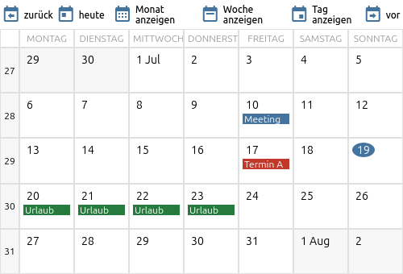
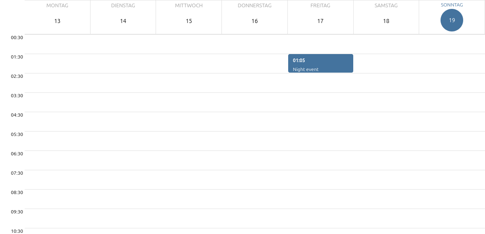
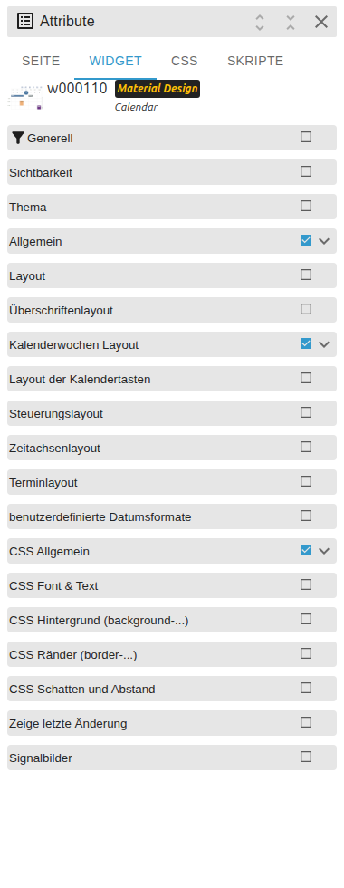

# Calendar

[User guide](../README.md) › [Widget catalog](README.md) · [Deutsch](../../de/widgets/calendar.md)

A native VIS 2 month, week and day calendar driven by a JSON event state.
Template id: `tplVis2-materialdesign-Calendar`.



Week/day view with time axis:



## Editor settings

<table>
<tr><td></td>
<td><ul><li><b>calendar view:</b> month, week or day.</li><li>Layout groups control weekdays, week numbers, header, controls and time axis.</li><li>Event settings control overlap, height and typography.</li><li>Custom format fields accept date token patterns.</li></ul></td></tr>
</table>

```json
[
    {
        "start": "2026-07-18T10:00:00",
        "end": "2026-07-18T11:00:00",
        "name": "Meeting",
        "color": "#44739e",
        "colorText": "#ffffff"
    }
]
```

The state must contain a JSON array.
