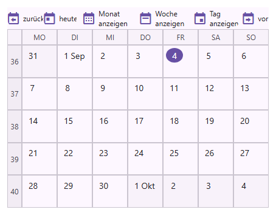
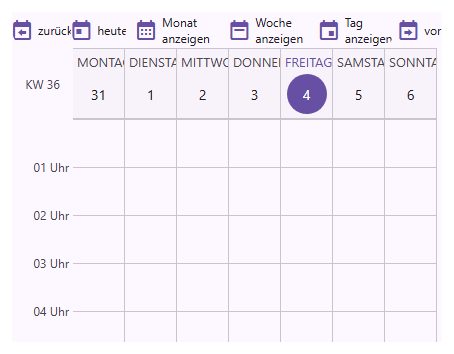
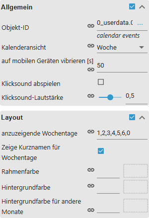
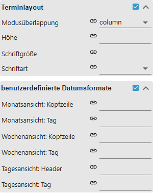
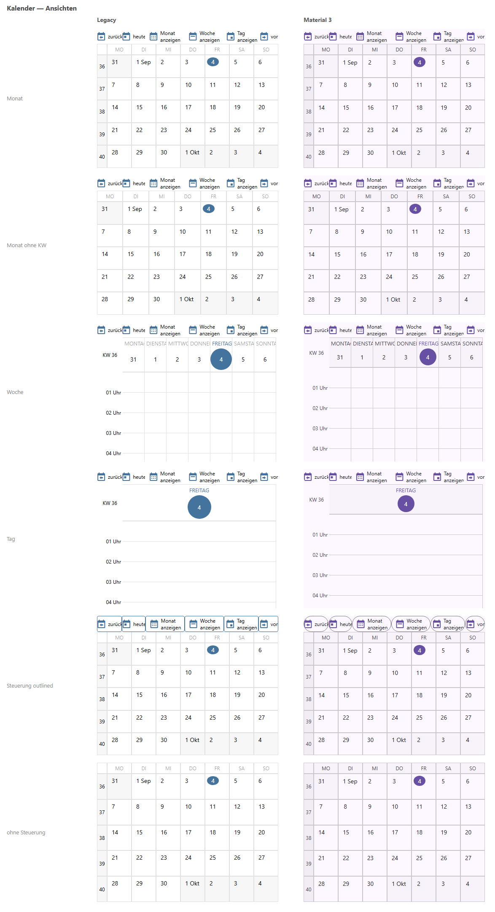
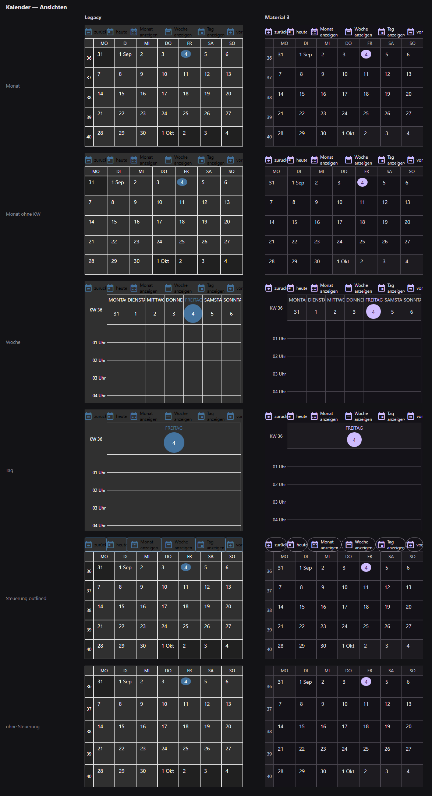

# Calendar

[User guide](../README.md) › [Widget catalog](README.md) · [Deutsch](../../de/widgets/calendar.md)

A native VIS 2 month, week and day calendar driven by a JSON event state.
Template id: `tplVis2-materialdesign-Calendar`.



Week/day view with time axis:



## Editor settings

The screenshots show the general/layout groups and the event/date-format groups.
Settings not listed below are self-explanatory. The editor UI follows the
ioBroker system language, so the screenshots are German.



**General**

- **object id** – state with the JSON event array.
- **calendar view** – month, week or day.

**Layout**

- **weekdays / short weekdays** – full or abbreviated weekday names.
- **border / day background colors** – grid and day-cell colors.

Event display and date formats have their own groups:



- **event overlap mode** – how simultaneous events are arranged in the week and
  day view: *column* splits the width between them, *stack* offsets them on top
  of each other. Month view lists events below each other anyway, so the setting
  has no effect there.
- **event height / fonts** – size and typography of events.
- **custom date formats** – per-view header and day format strings using date tokens (e.g. `dddd`, `D. MMMM`).

The header, week-number, controls and time-axis layout groups style the
remaining calendar chrome. Two settings there are not self-explanatory:

- **show calendar week** – a week-number column on the left in month view, and
  the week number in the corner above the time axis in the week and day view;
  font and color come from the same group.
- **… go to** – the day number switches to the configured view and takes the
  clicked day with it.
- **show current time / current time color** – a line on the current time in the
  week and day view, moved on every minute.
- **time axis background / time axis header background** – the first colors the
  time column, the second the cell above it; together the whole column.

```json
[
    {
        "start": "2026-07-18T10:00:00",
        "end": "2026-07-18T11:00:00",
        "name": "Meeting",
        "color": "#44739e",
        "colorText": "#ffffff"
    }
]
```

The state must contain a JSON array.

## ical adapter

The state `ical.0.data.table` can be used directly. The widget reads the field
names of the ical adapter (`event`, `_date`, `_end`, `_allDay`, `_calColor`)
next to the format above and converts its UTC timestamps to local time. All-day
events arrive from there with an exclusive end — the last day is not counted, the
same as in the calendar itself.

## Design style

The **Classic** (left) and **Material 3** (right) style side by side, see
[Design style](../README.md#design-style): the month view with and without week
numbers, the week and day view, outlined controls and the calendar without
controls.



The same widgets with the dark theme switched on:


