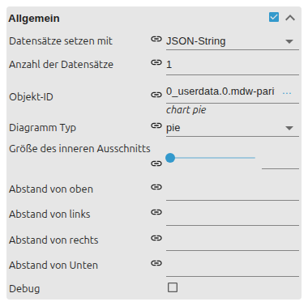

# Pie chart

[User guide](../README.md) › [Widget catalog](README.md) › [Charts](charts.md) · [Deutsch](../../de/widgets/chart-pie.md)

Shows current values as portions of a pie or doughnut.
Template id: `tplVis2-materialdesign-Chart-Pie`.

## Data source

- **Editor input:** each segment reads its own state.
- **JSON string/object:** one state provides all segments as a JSON array.
- **Doughnut:** cutout controls the size of the empty center as a percentage.

Negative input values are displayed as `0`. Use Bar or JSON Chart for data that
contains positive and negative values.

## Editor settings

The editor UI follows the ioBroker system language, so the screenshot is German.
Settings not listed below are self-explanatory.



- **General** – data source (editor segments or one JSON state), segment count, object id, **type** (pie or doughnut) and the **cutout** that sizes the empty center. Per editor segment, an indexed group adds its object id, label and color.

The shared **Chart layout**, **Legend** and **Tooltip** groups from
[Charts](charts.md) apply here too.

## JSON format

The format matches [Bar chart](chart-bar.md) datasets, except that Pie Chart does
not need `valueText`.

| Property | Meaning |
| --- | --- |
| `label` | segment name and legend entry |
| `value` | numeric, non-negative portion |
| `dataColor` | color of this segment |
| `valueAppendix` | suffix after the tooltip value |
| `tooltipTitle` | custom tooltip title |
| `tooltipText` | custom tooltip body |

```json
[
    { "label": "Self-consumption", "value": 68, "dataColor": "#43a047" },
    { "label": "Export", "value": 32, "dataColor": "#f9a825" }
]
```

## Relevant layout options

- An individual segment color takes precedence over the color scheme and global color.
- Tooltip minimum and maximum decimals format only automatically generated values. A custom `tooltipText` replaces that output.
- Legend and chart share the available space. For many segments, use a top or bottom legend with a wider widget.
