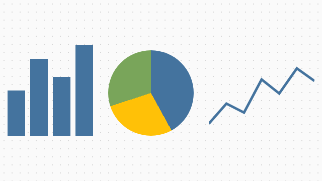
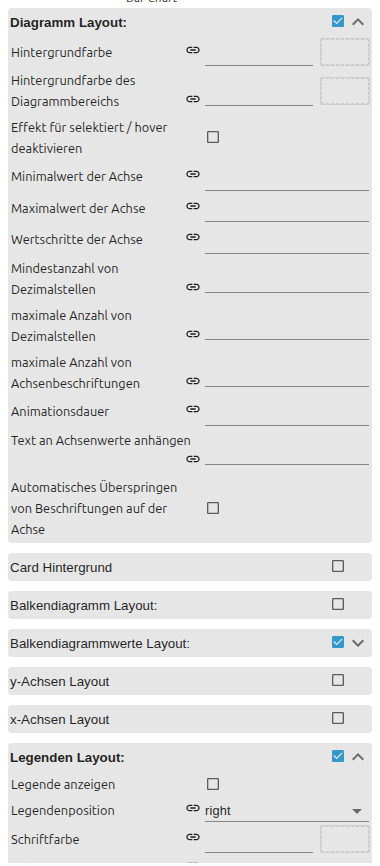

# Charts

[User guide](../README.md) › [Widget catalog](README.md) · [Deutsch](../../de/widgets/charts.md)

Four native VIS 2 charts for different data sources.

## Widgets

- [Bar chart](chart-bar.md) – compare individual current state values.
- [Pie chart](chart-pie.md) – show proportions of individual current state values.
- [JSON chart](chart-json.md) – combine several bar and line datasets from one JSON state.
- [Line history chart](chart-line-history.md) – load time series directly from a history instance.

Bar and Pie can read values from indexed editor datasets or from one shared JSON
state. JSON Chart uses a separate multi-dataset format. Line History queries
historic values through the selected history adapter instance.

## Shared settings

All four charts share these groups. The screenshot has the **Chart layout** and
**Legend** groups expanded. The editor UI follows the ioBroker system language,
so the screenshots are German.

**Chart layout** – general appearance: background colors, value-axis defaults
(min / max, decimals) and animation duration.

**Card background** – optionally wraps the chart and an HTML title in a Material
Design card.

**Legend** – whether the legend is shown and its **position**: top / bottom
arrange entries horizontally, left / right vertically.

**Tooltip** – shows values when a chart element is touched or hovered.

A **color scheme** distributes a palette across datasets that have no individual
color.
