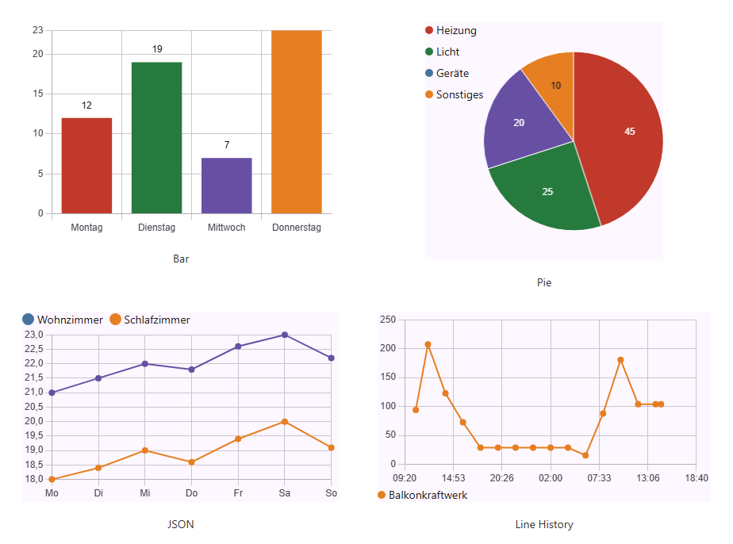
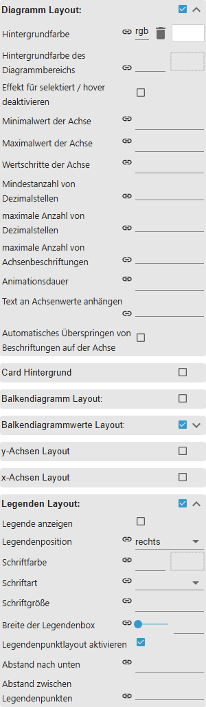

# Charts

[User guide](../README.md) › [Widget catalog](README.md) · [Deutsch](../../de/widgets/charts.md)

Four native VIS 2 charts for different data sources.

## Widgets

- [Bar chart](chart-bar.md) – compare individual current state values.
- [Pie chart](chart-pie.md) – show proportions of individual current state values.
- [JSON chart](chart-json.md) – combine several bar and line datasets from one JSON state.
- [Line history chart](chart-line-history.md) – load time series directly from a history instance.

Bar and Pie can read values from indexed editor datasets or from one shared JSON
state. **Number of data sets** is a count: 3 gives three data sets, in the groups
Data set [0] to [2]. VIS 1 stored the last index there, where 3 meant four data
sets — so check the value once when rebuilding an old chart. JSON Chart uses a separate multi-dataset format. Line History queries
historic values through the selected history adapter instance.

## Shared settings

All four charts share these groups. The screenshot has the **Chart layout** and
**Legend** groups expanded. The editor UI follows the ioBroker system language,
so the screenshots are German.

**Distance from top / left / right / bottom** – padding between the plot and the
edge of the widget. A side left empty keeps the spacing chart.js picks itself.
The four fields sit in **General** for Bar and Pie, in **Chart layout** for JSON
Chart and Line History.

**Chart layout** – general appearance: background colors, value-axis defaults
(min / max, decimals) and animation duration.

**Card background** – optionally wraps the chart and an HTML title in a Material
Design card. **title font size** sizes that title.

**Legend** – whether the legend is shown and how it looks. Bar, Pie and JSON
Chart share one legend:

- **legend position** – top / bottom arrange entries horizontally, left / right
  vertically, and decide whether the legend sits before or after the plot.
- **activate legend point layout** – round dots instead of square boxes.
- **legend box width** – size of that marker; font, color, padding and the
  distance to the plot follow.

Bar and Pie keep the legend switched off until it is enabled, JSON Chart shows it
by default.

**Values** (*bar chart values layout* / *pie chart values layout*, and per dataset
in Line History) – the labels drawn onto the chart itself:

- **show values** – `on` labels every bar, slice or point, `off` none, `auto`
  leaves it to chart.js. Bar and Pie default to on, Line History to off: a
  history line carries hundreds of points and a label on each of them is a wall
  of text.
- **label every nth value** – thins the labels out, for example `5` to label
  every fifth point.
- Font, color, box and placement of the labels follow in the same group.

**Tooltip** – shows values when a chart element is touched or hovered. Besides the
colors, its geometry is configurable: **arrow size**, **tooltip distance**,
**border radius**, **x-padding** / **y-padding**, **title distance to bottom**
and **show color box**. **text appendix** is appended after the value (Bar and
Pie), and **text minimum / maximum decimals** format the tooltip number — these
are separate from the value labels, which carry their own decimals.

**Hover effects** – **disable hover effects**, in the Chart layout group, turns
the highlight off completely; without it, **hover color** (Bar, Pie) and **hover
border color / width** (Pie) paint the element under the pointer.

A **color scheme** distributes a palette across datasets that have no individual
color.

