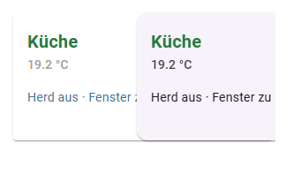
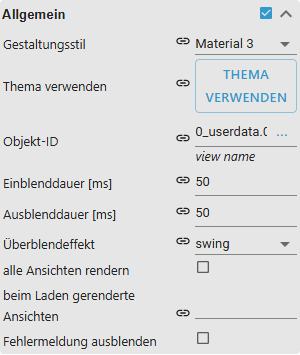

# Advanced View in Widget

[User guide](../README.md) › [Widget catalog](README.md) · [Deutsch](../../de/widgets/html-widgets.md)

A child-view container that embeds complete VIS 2 views and selects one from a
state.

Template ids: `tplVis2-materialdesign-view-in-widget` and
`tplVis2-materialdesign-view-in-widget8`.

## Editor settings

The screenshot shows the **General** group. Settings not listed below are
self-explanatory. The editor UI follows the ioBroker system language, so the
screenshots are German.

**General**

- **object id** – the state whose value selects the embedded view. For
  `view-in-widget` the value is the view **name** (string, exactly as in the
  editor); for `view-in-widget8` it is the **index** `0 … n` of the views
  configured below (number, `true`/`false` count as `1`/`0`).
- **views** – the VIS 2 views that can be shown.
- **fade in / out** – transition when switching between views.
- **pre-render** – optionally keep views mounted so switching is instant. The
  entry fields only appear once **views rendered on load** is set to at least
  `0`, and they take effect together with **render all views**.

The `8` variant adds indexed state-value-to-view entries:

- **keep loaded** – all configured views stay mounted, which makes switching
  instant. Without it only the selected view is rendered.
- **not if invisible** – while the widget is hidden its views are dropped
  instead of kept running in the background.

**Troubleshooting:** with **debug** enabled the widget logs the state value and
the resolved view to the browser console on every switch.

Use [Responsive Layout](responsive-layout.md) instead when multiple child views
must be arranged at the same time.

The state that selects the view usually comes from a menu: the
[Top App Bar](top-app-bar.md) writes the index of the selected menu entry, and
the `8` variant shows the matching view.
