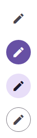
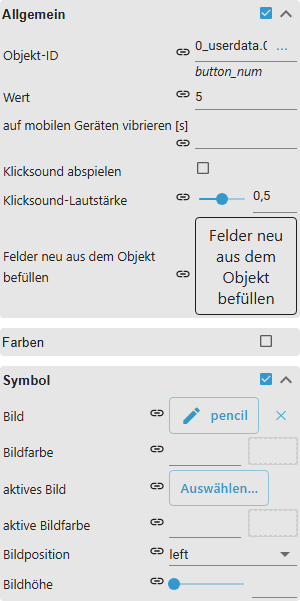
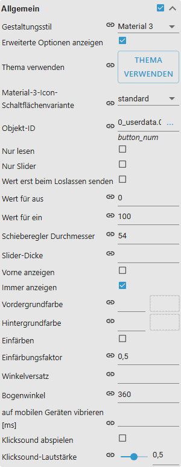
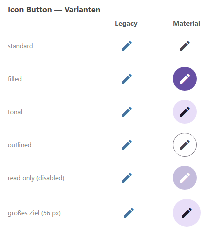
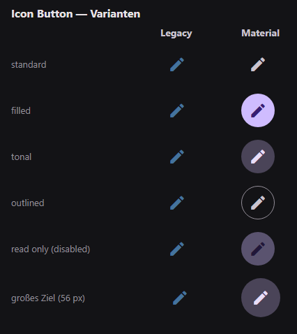

# Icon Buttons

[User guide](../README.md) › [Widget catalog](README.md) · [Deutsch](../../de/widgets/icon-buttons.md)

Compact icon-only VIS 2 buttons for navigation, links, state, multi-state,
addition, toggle and a circular value slider.

Template ids start with `tplVis2-materialdesign-Icon-Button-`, followed by
`Navigation`, `Link`, `State`, `State-Multi`, `Adition`, `Toggle` or `Slider`.

## Editor settings

The screenshots show a normal icon button and the circular *Slider* variant.
Settings not listed below are self-explanatory. The editor UI follows the
ioBroker system language, so the screenshots are German.

**Common** – the action fields match the corresponding [button](buttons.md)
variant (target view, URL, object id and value, …).

The icon button has no **labeling** group — it carries no text.

**icon**

- **Image** / **active image** – Material Design icon name or image source, the
  second one for the on state.
- **image color / active image color** – recolor a single-color icon; a separate
  color can mark the on state.
- **image height** – size of the icon inside the round button.

The **Slider** variant turns the button into a circular value slider:

- **Slider only** – value control without the click action.
- **Send value on release** – writes the value once at the end of the drag
  instead of continuously.
- **value for off / value for on** – value range mapped onto the arc, 0 to 100
  by default.
- **Angle offset / Arc angle** – where the arc starts (0 is the top) and how
  many degrees it sweeps, 360 by default.
- **slider diameter** – diameter of the arc, 48 to 160 px; the stroke width is
  **Slider thickness** (4 px by default).
- **Foreground color / background color** – arc and arc track.
- **Show in front** puts the arc above the icon instead of below it, **Always
  show** keeps it visible; without it the arc only appears on hover or touch.
- **Colorize** / **Colorize factor** – dims the icon as the value drops; the
  factor (0.5 by default) sets how strongly.

Material Design icon names, local image paths, URLs and data URLs are supported.
Single-color SVGs can be recolored with the icon color.

## Design style

The **Classic** (left) and **Material 3** (right) style side by side, see
[Design style](../README.md#design-style): the standard, filled, tonal and
outlined variants, read-only and a 56 px touch target.

The same widgets with the dark theme switched on:

