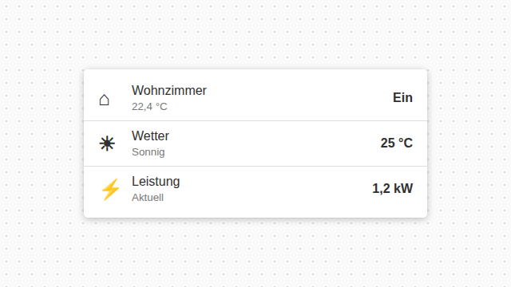
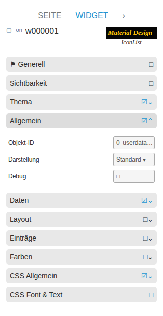

# IconList

[Back to README](../../../README.md#widget-documentation)

Displays state-dependent icons in a responsive VIS 2 icon grid. Data can be
entered in the editor or read from JSON. Template id:
`tplVis2-materialdesign-Icon-List`.

## Editor settings

<table>
<tr><td></td>
<td><ul><li><b>data method:</b> indexed editor entries or JSON state.</li><li>Each entry selects object id, off/on icon and colors, label and click action.</li><li>Layout settings control columns, spacing, alignment and icon size.</li></ul></td></tr>
</table>

Icons accept Material Design icon names and image sources. Use the active icon
fields for a separate on-state appearance.
