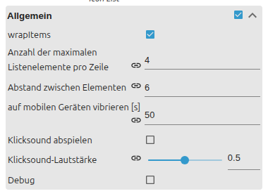

# IconList

[User guide](../README.md) › [Widget catalog](README.md) · [Deutsch](../../de/widgets/iconlist.md)

Displays state-dependent icons in a responsive VIS 2 icon grid. Data can be
entered in the editor or read from JSON. Template id:
`tplVis2-materialdesign-Icon-List`.

## Editor settings

The screenshots show the data groups and the grid layout. Settings not listed
below are self-explanatory. The editor UI follows the ioBroker system language,
so the screenshots are German.

**Data of the list**

- **data method** – indexed editor entries or a JSON state.
- **number of entries** – how many indexed item groups exist.

Each cell is configured in its own indexed **List item [n]** group:

- **object id** – state that drives the cell.
- **icon color / active color** – off-state and on-state color of the icon.
- **label / subLabel / value** – texts under the icon; **value appendix** adds a unit.
- **visibility condition** – hides the cell unless a state matches.

The grid arrangement lives in the **General** group:

- **wrap items / max items per row** – how cells flow into rows.
- **item gaps** – spacing between cells.

Cell and icon dimensions (icon height, item min width / height) live in the
optional **Item layout** group.

Icons accept Material Design icon names and image sources. Use the active icon
fields for a separate on-state appearance.
