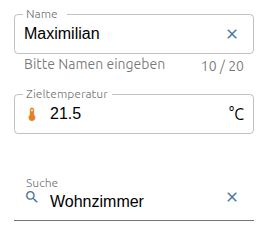
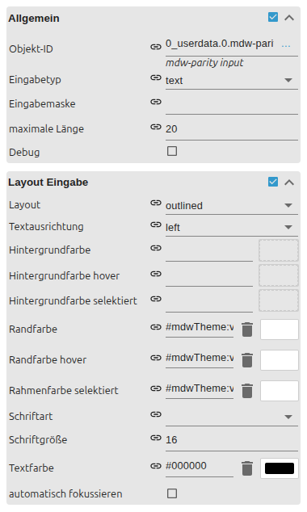

# Input

[User guide](../README.md) › [Widget catalog](README.md) · [Deutsch](../../de/widgets/input.md)

A native VIS 2 field for entering text or numbers.
Template id: `tplVis2-materialdesign-Input`.

## Editor settings

The screenshot shows the **General** and **Input layout** groups expanded.
Settings not listed below are self-explanatory. The editor UI follows the
ioBroker system language, so the screenshots are German.

**General**

- **type** – text, number, date, time or **mask**.
- **input mask / max length** – the fixed input pattern and character limit used by the mask type.

**Input layout**

- **layout** – outlined, filled, solo (borderless) and the rounded / shaped variants.
- **alignment** – horizontal alignment of the entered text.

Character counter and clear icon (**Counter layout**), and labels, hints,
prefix/suffix, inner icons and colors live in their own optional groups.

To choose from a list of values use the [Select](select.md) widget instead.
