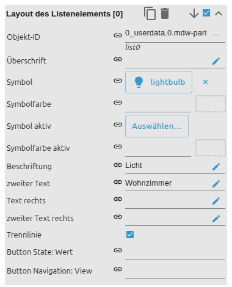

# List

[User guide](../README.md) › [Widget catalog](README.md) · [Deutsch](../../de/widgets/list.md)

A configurable VIS 2 list with text rows, buttons, switches or checkboxes.
Rows can come from indexed editor fields or a JSON state. Template id:
`tplVis2-materialdesign-List`.


## Editor settings

The screenshots show the list-wide groups and one indexed row entry. Settings not
listed below are self-explanatory. The editor UI follows the ioBroker system
language, so the screenshots are German.


**List layout**

- **list type** – text row, state / toggle / navigation / link button, switch or checkbox.
- **list layout** – standard, card or outlined card.
- **divider style** – separator drawn between rows.

**Data of the list**

- **data method** – indexed editor entries or a JSON object state.
- **number of entries** – how many indexed row groups exist (editor method).

Each row is configured in its own indexed **List item [n]** group:



- **object id** – state shown/controlled by the row.
- **label / subLabel / right label** – primary, secondary and right-aligned text.
- **icon + active color** – row icon and its on-state color.
- **button / toggle values** – the value(s) written by the button/toggle list types.

Minimal JSON example:

```json
[{ "objectId": "0_userdata.0.light", "text": "Light", "subText": "Living room", "image": "lightbulb" }]
```
