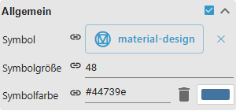

# Material Design Icons and Utilities

[User guide](../README.md) › [Widget catalog](README.md) · [Deutsch](../../de/widgets/material-design-icons-and-images.md)

Native VIS 2 utility widgets for a standalone icon, color-scheme preview and
installed package version.

Template ids: `tplVis2-materialdesign-Icon`,
`tplVis2-materialdesign-ColorScheme-Preview` and
`tplVis2-materialdesign-Installed-Version`.

## Editor settings

The screenshot shows the **Icon** widget with its **General** group expanded.
Settings not listed below are self-explanatory. The editor UI follows the
ioBroker system language, so the screenshots are German.

**General (Icon widget)**

- **image** – a Material Design icon name (e.g. `lightbulb`), an image path/URL or a data URL.
- **icon color** – recolors single-color SVG/icons through a CSS mask; multi-color images stay unchanged.
- **use icon size for image** / **width / height** – force a fixed icon size instead of the automatic one.
- **object id** – optional; only needed when the icon should react to a state value.

The **Color Scheme Preview** widget shows the available Material Design palettes,
and **Installed Version** shows the packaged widget version — both need no options.

Icon/image fields accept Material Design icon names, common image paths, HTTP(S)
URLs and data URLs. SVG masks support a single configured color.

## Two icon sources

Every icon/image field opens the same picker, and the picker has two sources.
Switch between them with the **MDI** / **Symbols** buttons above the icon grid.

- **MDI** (default) – [Material Design Icons](https://pictogrammers.com/library/mdi/),
  7447 glyphs. This is the set the original adapter used, so every saved project
  keeps working unchanged. A name may be written with or without the prefix:
  `lightbulb` and `mdi-lightbulb` are the same icon.
- **Symbols** – [Material Symbols Outlined](https://fonts.google.com/icons), Google's
  current icon set and the one Material 3 is drawn against. A Symbols name is
  always stored **with the `ms-` prefix**: `ms-light_mode`, `ms-schedule`. The
  prefix is what tells the two sets apart — several names exist in both, and
  without it `light_mode` would be looked up as an MDI icon and not render.

Both sets are self-hosted, so neither needs internet access at runtime. They are
separate webfonts and a panel downloads one only when a glyph from it is actually
drawn: a view with MDI icons only never fetches the Symbols font, and the other
way round. Mixing both in one view costs both downloads.

You can type a name directly into the picker's text field instead of scrolling
the grid — it accepts `mdi-name`, `ms-name` and an image path alike.
