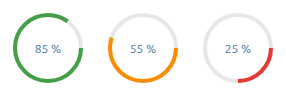
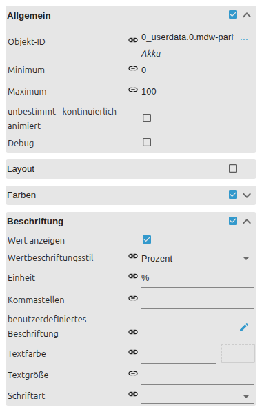

# Progress Circular

[User guide](../README.md) › [Widget catalog](README.md) · [Deutsch](../../de/widgets/progress-circular.md)

A circular VIS 2 progress indicator with the same value mapping and labels as
the linear progress widget. Template id:
`tplVis2-materialdesign-Progress-Circular`.

## Editor settings

The screenshot shows the **General**, **Layout** and **Label** groups expanded.
Settings not listed below are self-explanatory. The editor UI follows the
ioBroker system language, so the screenshots are German.

**General**

- **min / max** – map the state value onto 0–100 percent.
- **indeterminate** – continuous spin that ignores the value (busy indicator).

**Layout**

- **size** – diameter of the ring.
- **ring width** – thickness of the progress stroke.
- **rotate** – start angle of the ring.

**Label**

- **label style** – percent, raw value or a custom template.
- **unit** – text appended to the value.
- **custom label** – free text/binding used when the style is *custom*.

In **Colors** you set the progress color, the background ring, the inner (center)
color and two optional threshold colors that replace the progress color by
condition.
