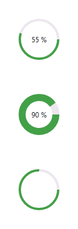
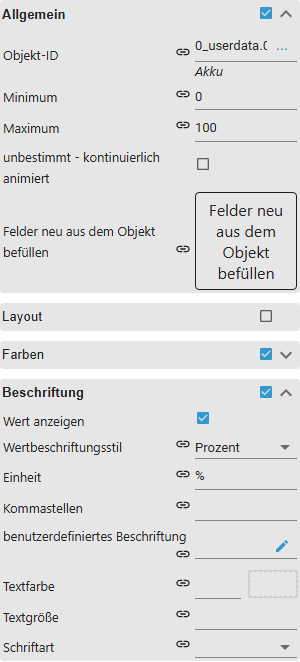

# Progress Circular

[User guide](../README.md) › [Widget catalog](README.md) · [Deutsch](../../de/widgets/progress-circular.md)

A circular VIS 2 progress indicator with the same value mapping and labels as
the linear progress widget. Template id:
`tplVis2-materialdesign-Progress-Circular`.

## Editor settings

The screenshot shows the **General**, **layout** and **labeling** groups
expanded. Settings not listed below are self-explanatory. The editor UI follows
the ioBroker system language, so the screenshots are German.

**General**

- **Minimum / Maximum** – map the state value onto 0–100 percent. A boolean state
  counts `true` as the maximum and `false` as the minimum.
- **indeterminate - continuously animates** – a permanent rotation that ignores
  the value (busy indicator).

**layout**

- **size** – diameter of the ring. Left empty it fills the widget.
- **thickness** – width of the ring.
- **rotate start point** – start angle in degrees, the default starts at the top.

**labeling**

- **show value** – hides the label in the centre.
- **value caption style** – `percent`, `value` (the state value plus **unit**) or
  `custom`.
- **custom label** – free text for the `custom` style. `[#value]` inserts the
  state value, `[#percent]` the percentage.
- **decimal points** – decimals of both numbers.

**colors**

- **color progress / background color** – the ring and its track.
- **circle background color** – fills the area inside the ring.
- **condition for color 1 progress [>] / color 1 progress** and the same pair for
  color 2 – the condition is a **percentage**, not the state value.

## Design style

The **Classic** (left) and **Material 3** (right) style side by side, see
[Design style](../README.md#design-style): the linear bar at low, medium and
high values, square and striped, indeterminate, plus the circular variant
determinate, thick and indeterminate.

The same widgets with the dark theme switched on:

