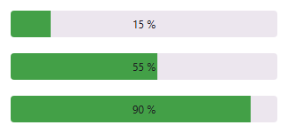
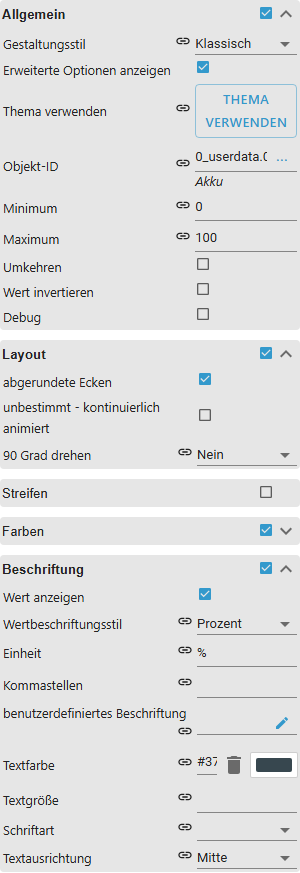
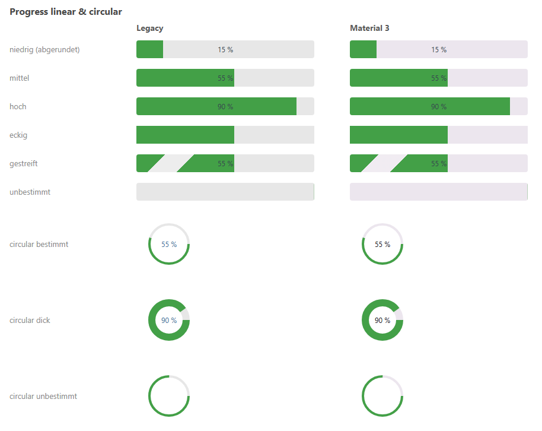
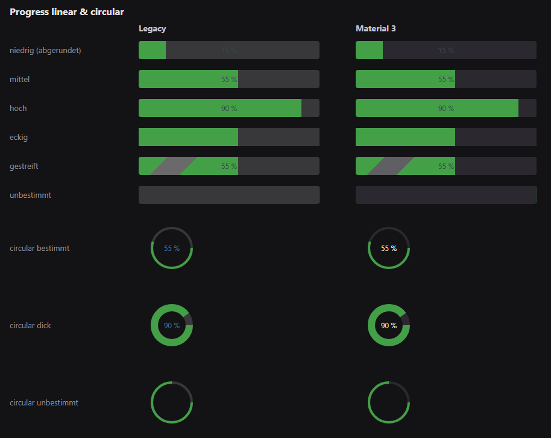

# Progress

[User guide](../README.md) › [Widget catalog](README.md) · [Deutsch](../../de/widgets/progress.md)

A linear VIS 2 progress indicator for numeric or boolean states. Template id:
`tplVis2-materialdesign-Progress`.

## Editor settings

The screenshot shows the **General**, **Layout** and **Label** groups expanded.
Settings not listed below are self-explanatory. The editor UI follows the
ioBroker system language, so the screenshots are German.

**General**

- **min / max** – map the state value onto 0–100 percent.
- **reverse** – fills from the opposite side.
- **invert value** – shows the remaining percentage instead of the reached one.

**Layout**

- **rounded** – rounds the bar ends.
- **indeterminate** – continuous animation that ignores the value (busy indicator).
- **rotate** – rotates the whole bar by a given angle.

**Label**

- **label style** – percent, raw value or a custom template.
- **unit** – text appended to the value.
- **custom label** – free text/binding used when the style is *custom*.

The **Striped** group enables and styles a stripe pattern. In **Colors**, two
optional threshold colors (each with a condition) replace the normal progress
color once the value passes them.

## Design style

The **Classic** (left) and **Material 3** (right) style side by side, see
[Design style](../README.md#design-style): the linear bar at low, medium and
high values, square and striped, indeterminate, plus the circular variant
determinate, thick and indeterminate.

The same widgets with the dark theme switched on:

